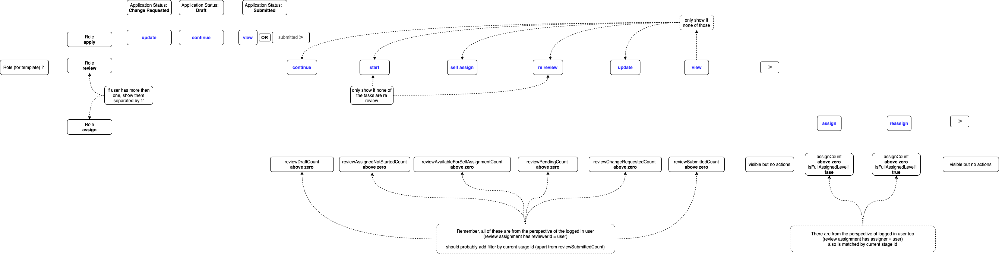

Actions define what a user can do related to an existing application. The actions take in account the current user own permissions to `apply` and the application template_permission to `review` or `assign` based on the current `level` and `stage` of the review.
So basically we will define actions related to user roles of: **Applicant**, **Assigner**, **Reviewer** and **Consolidator** (basically actions are the same as Reviewer).

**Note**: The same user can have more than one user-role. e.g. Assigner and reviewer.
**Note 2**: One restriction is to not have an Applicant user with other user-role. This combination isn't prevented on the server though.

Let's have a look on the action definitions for any user-roles:

## Applicant's actions

Actions are available to the applicant user for their own applications, and very basic for now:

- `Continue` -> Application created that hasn't been submitted
- `View` -> Application that has been submitted or after application process is completed
- `Update` -> After an application has been submitted and reveiwed, when there are **changes required** to the Applicant

### Other applicant's actions (todo)

- `Withdraw` -> Application that has been submitted
- `Delete` -> Application that hasn't been submitted

## Reviewer's or Consolidator's actions

Actions are available to the Reviewer user (based on `template_permission`) after the **application is submitted**.
Actions more specific to the Consolidator user are available after there is a review **stage increment** or after **review is submitted**.

- `Continue` -> Review created that hasn't been submitted
- `Start` -> Review has been assigned (or self-assigned)
- `Self-Assign` -> Review hasn't been assigned to anyone (and permission to SELF_ASSIGNMENT applies)
- `Re-Review` -> Review has been submitted and lower level Reviewer has submitted **changes requested** by you
- `Update` -> Review has been submitted and higher level Reviewer has submitted **changes requested** to you
- `View` -> Review has been submitted or after application process is completed

## Assigner's actions

The options are per section of the application, but will show on the application list as the top most possible one (combining the actions available for all sections in the application):

- `Assign` -> When there is still a section without some reviewer assigned
- `Re-assign` -> When there is a reviewer already assigned to each section

**Note**: When re-assigning section(s), any `review_responses` that have already been created (due to the reviewer starting their review) are kept. This would mean that if the original reviewer was re-assigned back at some point, they could continue the same partially-completed review.

## Generating and display of actions

Actions are displayed in 2 main places: on the Applications list and on the Review home page (for Reviewer/Assigner) or Application home page (for Applicant)

### Applicant home page (or list)

The GraphQL query (`getApplication` and `getApplicationList`) simply gets application related to the current user and the `status`, which is used to define the action to be displayed.

- `Continue` -> Application with `status` = DRAFT (and owned by the current user)
- `View` -> Application with `status` = SUBMITTED or others (e.g. COMPLETED, EXPIRED, ...)
- `Update` -> Application with `status` = CHANGES_REQUIRED

**Note**: For now the front-end allows a user to see any application, not only restricted by user permission. Later, when restrictions apply, only users with appropriate permissions will be able to see other users' application statuses.

### Review home page (or list)

The **Assignment tab** shows review assignments for the current stage, with a selector to choose between the current review level, or all levels for this stage.

Each section displays:

- 1 row regarding the assignment the level selected (or one per level when "All levels" is selected)
- 1 row for the associated review (or one row per level assigned when "All levels" is selected)

On server side we calculate the count of each of the following fields (used to define each available action on the front-end) based on status of `review_assignment` and `review`.
The GraphQL queries (`getReviewInfo` and `getApplicationList`) will fetch ALL `review_assignment` related to the current application `serial`, for all reviewers `user` of the selected `stage` and `level` (or all levels if this option is selected).

For each `review_assignment` with status ASSIGNED and with review status SUBMITTED, there is the default action to `View`.

Otherwise if `review_assignment` and `review` is associated to the current user, will generate one of the following actions and display in each of the assigned sections:

Actions generated for **reviewer** user will check which of the count (of owned review/assignment) field is above 0 to display the action (as the top most possible one).

- `Continue` -> review_draft_count
- `Start` -> review_assigned_not_started_count
- `Re-Review` -> review_pending_count
- `Update` -> review_change_request_count
- `View` -> review_submitted_count

**Note**: For now the front-end is displaying all reviews associated with the current application on the "Review Home page". Later, when restrictions apply, only users with appropriate permissions will be able to see other users' review statuses.

Actions generated for **assigner** user will check which of the count (of ALL review/assignment) field is above 0 or `true`,

- `Assign` -> assigned_questions_count (application_id, $1, level_number) < reviewable_questions_count
- `Re-assign` -> (assigned_questions_count >= reviewable_questions_count (application_id)) AND (submitted_assigned_questions_count < reviewable_questions_count (application_id))

**Note**: If user is both an Assigner and Reviewer for the current application only the action for reviewer is displayed.
