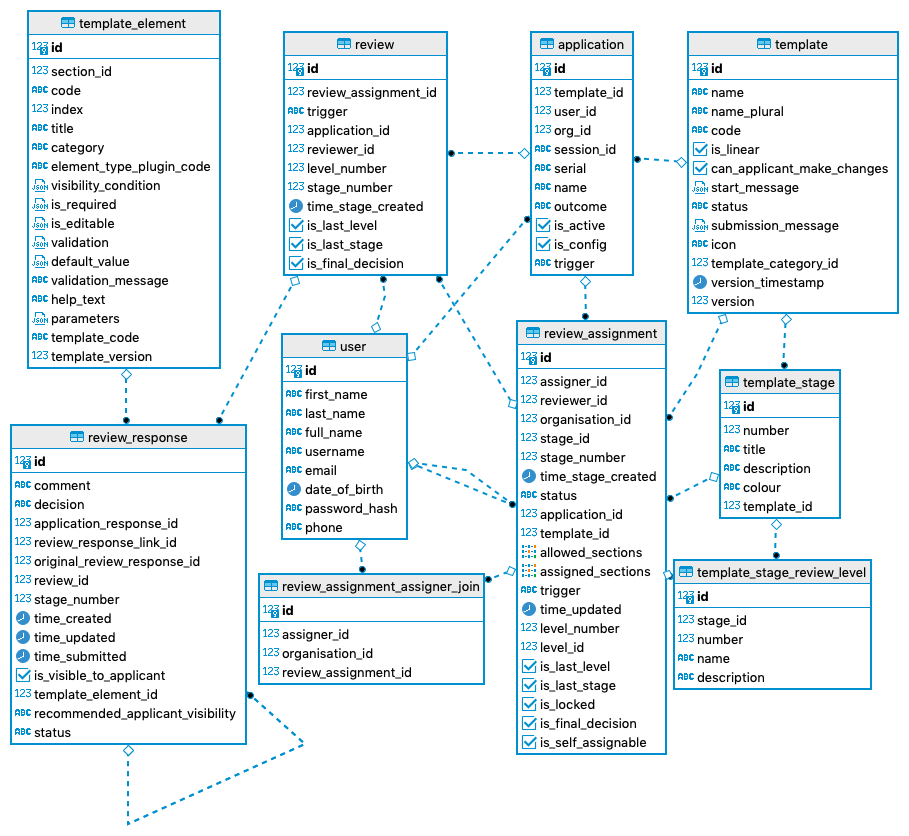

# Assignment Process

The logic of assigning a review spans between both web app and server — front end is only concerned with queries and mutations to review_assignment table, whereas back end does most of the grunt work (through actions and triggers) and generates records in those tables based on user permissions and states of application and its review.

## Schema

Seems like a good starting (anchor) point for describing this functionality, let's have look:

First of all, some bulletpoint (and rules) to help clarify the diagram

### Assignment rules

- One `review_assignment` should exist per reviewer/application/stage/level
- Review assignment should only be assignable by a reviewer if has `is_self_assignable` = **True**, otherwise by linked `Assigner`.
- Review assignment should not be editable once stage of review assignment is different to the current application stage.
- `is_last_level` field is an automatically calculated field to help front-end (to avoid front ending needing to figure if if review is last level for given stage)

### Assignment status

Review assignment can have the following statuses

- `Available` -> Can be assigned by assigner
- `Assigned` -> indicates that the reviewer is able to create a review (or one already exists)
  - At least one section is included in field `assigned_sections` on review_assignment

To also determine if this assignment can be Self-assigned, 3 other fields come on the scene:

- `is_self_assignable` -> Can be self assigned (if there is `available_sections` to be selected - how we prevent other self-assigning for sections already assigned)
- `is_locked` -> Used to prevent a Review from being submitted - in case another reviewer in same stage already send a response to Applicant (decision to "Send back to applicant")

Another possibility for assignment is using the flag:

- `is_final_decision` -> Used to assign reviewers to do a single-decision review. In this case the review will be always `is_self_assignable` and `is_last_level

### Restrictions

Review assignments can be restricted by section/s

- `template_section_restriction` is an array of section codes user can review
- Default is `null` which allow review of all sections or all questions in the application

### Assigner settings

- Review assignments of status **Available** can be assigned by assigners
- Review assignments of status **Assigned** with `Review.status` != **Submitted** can be unassigned or re-assigned by assigners
- Assigner is linked through the `review_assignment_assigner_join` table

#### Difference between self-assignment and assignment

The idea behind self assignment originated with requirement for users (who are not themselves assigners) to be able to 'choose' or pick which application they will be reviewing. When the assignment `is_self_assignment` or `is_final_decision` all sections will be assigned to the same user.

**Note**: Currently self assignment is not restricted by `template_section_restrictions`.

## Pre-assignment process

To reduce front-end logic, server is responsible for generating `review_assignment` records, based on user permissions. This is done by an action called `generateReviewAssignments` which is configured to fire when application or review changes status.
e.g.: Application is Submitted, Review is approved and moves to new Stage or Level.

### Application submission

The server logic looks at all of the permissions linked to application template of type `review`, where template permission configurations match current `level` and `stage`. It creates `review_assignment` records for users who are linked to that template permission (through permission name), and any extra configurations (`template_section_restrictions`, `canSelfAssign`, etc..) are populated for new review_assignment record.

### Review submission

The server logic does similar thing as what is done when Application is submitted, but for level + 1. Typical scenario is a consolidator being informed that they can self assign a consolidation when lower level reviewer submits a review.

## Assigning process

Available for either a Reviewer that can do **self-assignment** or an Assigner with permission to **assign** applications of a certain template type on a `level` and `stage` (settings defined on the `template_permission` of each Template).

To **assign** or **self-assignment** the Reviewer of sections of one application there are option available on the Applications list of on the Application home page.

## Web App - usage
### Assignment
A GraphQL mutation `updateReviewAssignment` is called in the front-end after the assigner user selects assigners in each section and clicks on the option to **Submit**.
When reviewer is the current user the dropdown only display the **Self-assign** option to select *Yourself* (which will propagate for all sections). Otherwise - when the Assigner user is commanding there will be a list of possible assignee per section. And if it is a Consolidation or One level stage the same assignee is propagate in all sections. The option to Assign All is also available on the bottom of the Assigment page. 

#### When Assigner clicks to Submit after assigning
For each different Assignee one mutation for Review_assignment is send with:
1. Set `review_assignment.trigger` set to ON_REVIEW_ASSIGN.
2. Changes `review_assignment.status` to **Assigned**.
3. Sets all `assigned_sections` on record - meaning that all elements of type QUESTION in these sections are also assigned

#### Other updates done on the server-side:
- Update other `review_assignment` to have field `available_sections` r. So other self-assignments for same application get locked.

### Re-Assignment
The same GraphQL mutation `updateReviewAssignment` is called in the front-end after the assigner user clicks on `re-assign` options, selects each new assigner (for each section) and clicks on the **Submit** button.

- Assigner clicks on **re-assign** option in one of the sections
- Then add a new reviewer in each drop down (for Consolidation, Final Decision or One level review the assignee is propagate in all sections)
- User clicks on **Submit** to register the change

#### After the Assigner clicks to Submit after re-assigning
For each different Assignee one mutation for Review_assignment is send with:
1. If all sections were unassigned from previous assignemnt
- For previous assignment set `review_assignment.trigger` to ON_REVIEW_UNASSIGN
- Set the status of previous assignment `review_assignment` to **Available**.
- And `assigned_sections` are set to empty array in the back-end.
2. Else for assignment with sections still assigned to previous assignment
- Set `review_assignment.trigger` to ON_REVIEW_ASSIGN
- Just update the previous assignment `assigned_sections` but keep status as **Assigned**.

#### Other updates done on the server-side after re-assignment
   - If an existing `review` was connected to previous assignment now UNASSIGNED it will change the `review.status` from **Draft** to **Discontinued**.
   - If an existing `review` was connected to new assignment REASSIGNED it will change the `review.status` from **Discontinued** to **Draft**.
### Unassignment
The same GraphQL mutation `updateReviewAssignment` is called in the front-end after the assigner user clicks on `unassign` options (in one of the sections) and confirms the warning modal clicking on the **Confirm** button.

- Assigner/Current reviewer clicks on **unassign** option in one of the sections
- A warning modal is presented to confirnm unassignment (from all sections this user is assigned)
- User clicks on the **Confirm** button to register the change

#### After the Assigner or Reviewer click on Confirm after unassigning
1. `review_assignment.trigger` is set to ON_REVIEW_UNASSIGN.
2. Changes status of `review_assignment` to **Available**
3. Set `assigned_sections` to empty array (done in back-end)

#### Other updates done on the server-side after unassignment
   - If an existing `review` was connected to this assignment will change the `review.status` from **Draft** to **Discontinued**.

## Diagram

This diagram is somewhat complex — it describes some functionality that is not implemented (re-assignment), but it can be helpful when visualising full assignment flow (and for analysing different scenarios of assignment)

# Front End Implementation

Best described in a diagram (this diagram is abstracted to only show bits related to assignments)

