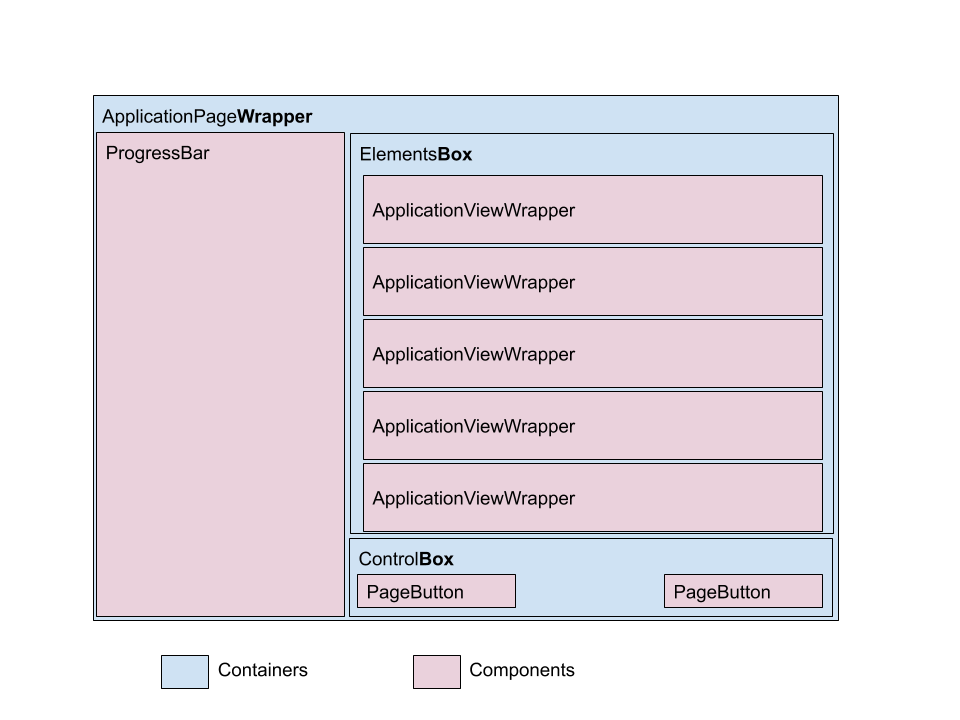
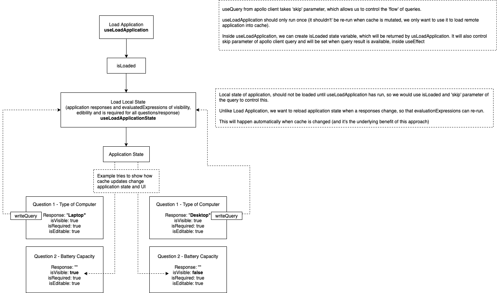
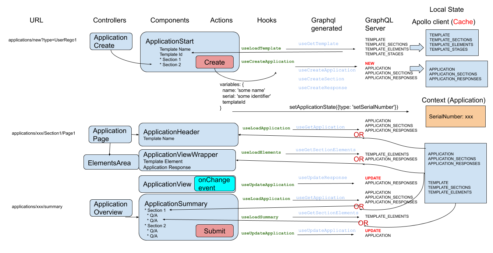

_This should help Front-end developers understand the flow of how React components and GraphQL calls interact and the current project structure._

## Project Workflow

We have a few rules to maintain our structure comprehensive. This rules may change with time, and we should keep this file up-to-date with the current ones. Check the rules in each section below.
Inside the `/src` folder all files used for the Front-end are distribuited in the following structure:

- `components`
- `containers`
- `contexts`
- `elementPlugins`
- `utils`
  - `generated`
  - `graphql`
  - `helpers`
  - `hooks`

### components

`Presentation components` or functional UI React components.

**Rule 1**: No logic should be done at the component level, it simply renders what is received in the `props`.

**Rule 2**: Grouping components that are using in a certain area of the app can be useful. For now we are keeping all application related component in the folder `src/components/Application`.

**Rule 3**: Each group folder has an `index.ts` file which imports all files in this folder and exports. That's to make it easier for outsider containers/components to import these files by using the `import { nameOfComponent } from './components'`.

### containers

`Controller components` will basically contain other React components.

**Rule 1**: The containers should make calls to the server (using hooks), keep local state variables and/or call hooks that transform the data into some local variable to be passed as required props on each `presentation components`.

**Rule 2**: Name containers with suffix `Wrapper` when they are simply calling other containers (that will then call the actual components). Or name containers with suffix `Box` when it is responsible for defining the layout and calling other components to be redered inside.

#### Example



### contexts

`Context areas` - each area is a file containing a block with some shared states.

**Rule 1**: Avoid using context for anything that can be fetched from the database (using Apollo client) or set in the local state (`useState`) and passed to other components as `props`.

- Apollo client CACHE is doing most of the local state management, other local states can be shared between components by `props`. But occasionally we need to pass information (that isn't in the database) from one component to another that are not directly connected.
- We are studying the idea of using Apollo cache directives (@client) for replacing with the existing contexts states. Or simple local states.
- **Important**: For a component be able to access something from a context area it will need to be (or some parent component needs to be) wrapped by the context provider! Check out how it's done in the `SiteLayout.tsx` file.

### elementsPlugins

aka `Question plugins` - This is used for all related code for the Question plugins.

- Each folder inside will defined each Question-type for the App. Inside each question-type folder there are 2 files:
  - `ApplicationView` => Define how this question is rendered during an application in progress/edited.
  - `TemplateView` => Defines how this question is rendered during the configuration of the template of one application.
  - `SummaryView` => Defines how the question and response given should show on the summary page (for Applicant or Reviewer).

### utils

To keep everything else :P

#### generated

Folder with a single file `graphql.tsx`

- The file gets re-generated (by manually running the script `yarn generate`) with the complete list of all the types related to the tables, relations and fields in the GraphQL server. And adds types to manually.
- The file also gets generated types for the `queries`, `mutation` and `fragments` defined in the next folder...

#### graphql

Folder storing all GraphQL queries, mutation and fragments (so everthing is in one place).

**Important**: Always check that the type for the files included in this folder are using `.ts` - or generation will fail!

**Rule 1**: All GraphQL calls are grouped in here to keep them all in one place and to be used for type generation.

**Rule 2**: After adding or editing queries, run the `yarn generate` script.

After the generation runs a new **custom hook** with all required types is defined in the `generated/graphql.ts` file named as the pattern.

Example: a new query called `getApplications.query.ts` will get a new hook (for querying) as `useGetApplicationsQuery`.

**Rule 3**: Use the **Pattern**:

- Query: `get` `Entity` `.` `query` `.ts`
- Mutation: (`create` | `update`) `Entity` `.` `mutation` `.ts`
- Fragment: (`add` | `remove`) `Entity` `.` `fragment` `.ts`

##### fragments

_What is a fragment?_ A partial query or mutation that can be used as part of other queries or (mainly) for getting or setting some data to the cache. We do have to update the cache after a mutation to keep it up-to-date.

##### queries

_What is a query?_ Something to be fetched from the GraphQL server. Can have some input and defines what is returned.

##### mutation

_What is a mutation?_ Something to be posted to the GraphQL server. Has some defined input and also something that is returned.

#### helpers

Add here any methods that can be used in other places - that aren't hooks or components itselves.

#### hooks

Our **custom hooks** - exaplained in more detail in the Development sections below.

### Files on the root src folder

- `cache.tsx` - Start the Apollo Cache.
  Also can define some local state to be used within the cache on the root level or as part of any table (@client). Read more [here](https://www.apollographql.com/docs/react/local-state/managing-state-with-field-policies/#storing-local-state-in-the-cache).

- `config.json` - Some global varibles to be used during the configuration of the App. i.e: GraphQL server host.

`index.tsx` - App start - Just connects the Apollo Cache (from `cache.tsx`), adds semantic-ui for UI and calls the main component: `App.tsx`.

---

# Local vs. Remote states

### Remote states

The local data kept in the app by Apollo client CACHE is considered remote state since it is a small mirror of the GraphQL server. The cached data is reused for up-coming queries (if we don't enforce a `refetch` from the server), returning the local **remote state** for the queried data - when it is available. Or it fetches from the server if not available in cache.

**Important**: No need to do anything different to query from the cache instead of the server. Just a simple query will do it. Mutations on the other hand require some addition - on creating new records, or deleting records or mutating more then one record a time: https://www.apollographql.com/docs/react/data/mutations/#making-all-other-cache-updates

_How Apollo keeps the cache synced with the server?_

Apollo client provides this cache management module, which will store all the data query or mutation results after it is fetched from the server. It requires you add the `id` of each entity - and the related entities included in the fetched data - or another identifier that you have specified before to the cache management instance if not using the `id`. The cache stores one instance of each entity queried (refreshing the App would clear out the cache!). And for each relationship it keeps a reference to its entity. In the end the remote states has one instance of each entity already fetched from the server.

_Why do we update the cache after mutations?_

When we create a new entity that has a relationship with some existing data in cache we need to also update the cache with the added entity! This is to avoid having to create a `refetch` to get this back from the server and keep the local cache up-to-date. In the same way, after editing an entity which is already in cache we need to remember to update this entity in the cache.

##### Example of remote data

- Current Application
- Application Sections (related entities - Application)
  - Template Sections (related entities - Application Section)
- Application Responses (related entities - Application)
  - Template element (related entities - Application Response)

### Local states

We are using 2 options for local states:

- local variables (with `useState`) passed as `props` to other components
- context areas (with `useContext`) for sharing between components

##### Example of local state

In ApplicationPageWrapper:

- List of all questions and responses

How to use:

1. `ApplicationPage` calls initial query to load the whole application, section and responses.
2. `ApplicationPage` calls a custom hook to create the list of questions and responses based on query.
3. Custom hook returns two result objects:
   a. The array of objects with all elements and its evaluated fields (after running the `evaluateExpression` on each question)

   - Element code (key)
   - Category: Information | Question
   - isRequired: boolean
   - isVisible: boolean
   - isValid: boolean
   - isEditable: boolean
   - validationMessage: string
   - ResponseId: number
   - ResponseJSON: JSON
   - ResponseValue: string

   b. A map Q&R with ONLY the **question** elements and the current value of responses given by the user.

   - Question code (key)
   - Response value: string | null

4. The two object evaluated elements and the Q&R are passed to `ElementsBox`.
5. The `ElementsBox` passes each related element to the `ApplicationViewWrapper`. Question elements would also receive the Q&R object (the map of all responses in the application) and the mutation to update the response `onFieldChange`. It should only update to the server and CACHE if the response is valid.
6. The `ApplicationPage` will update the elements and Q&R object when the **elements' query and responses** gets triggerd by a new mutation of one of the elements' valid response on the current application.



##### Example of context state

`src/contexts/ApplicationState.tsx`

This context area is used between components to share a few states:

- Application serial number (currently created on Front-end)
- Application id
- Application's sections total of pages - which gets deduced by the elements in each section.

---

# Development workflow

## Example

Process of creating one Application, going through each page until reach the summary page where the user can submit.



---

### Structure

While starting a **new page** check:

- New page is included in the `containers`.
  - Continue on the existing; or
  - Create a new file following the pattern:
    `Entity` + `Goal` + `Wrapper` | `Box`. Example: `UserRegisterWrapper`.
  - Use a group folder to combine pages of the same entity.
- Think about as many pieces of that can be used only for display a certain area of the page - adding to `components`:
  - These components should received (as props or importing one context area) everything to be presented.
  - Any action triggered by button should also be passed to the components.
- Add the new page to the `SiteLayout.tsx` in `src/containers/Main` folder.

  - If you need to have access to a context area, remember to wrap the Router of your container with it.
    Example:

  ```
  <Route exact path="/example">
    <UserProvider>
      <UserRegister />
    </UserProvider>
  </Route>
  ```

- Mainly we are using the Apollo cache for **state managment** (the alternative is to use context areas - the aim is to only use Apollo cache at some point). To gather what needs to be displayed you either will get it from the cached data (of previous calls to GraphQL) or make a new call to the GraphQL server.
  - Apollo client will handle this for you by simply making a call with your desired `query`. [Read more here](https://www.apollographql.com/docs/react/data/queries/#caching-query-results)
  - In some areas we would like to JUST store the changes in cache, so it's required to use `writeQuery` instead.

### Create custom hooks

When starting to create a query first check:

- If there is already one similar in `utils/graphql/queries`, you can adapt this one - considering other callers.
- Similarly, check `utils/graphql/mutations` if you need to send data (mutation) to GraphQL.
- If there isn't one already, create a new file that just returns the query (using the GraphQL query language).
  - The query will also defined what is returned!
  - Use a GUI tool to see the results for your query/mutation to the GraphQL server: `http://localhost:8080/graphiql` (if the server is running on localhost:8080).
  - Another helper is using the extension described in [here](setup/Apollo-client.md) on sections "VS code extension for typing GraphQL" to have autocomplete on the query you are writing directly on your file.

After you have finished adding the query/mutation:

- Run the script `yarn generate`.

  - If all goes well, in the `utils/generated/graphql.ts` file you can now view a **generated hook** for your new query/mutation. It links the Apollo hook `useQuery` or `useMutation` and adds all predefined types from Graphql.

    Example: If your query was called `getUsers.query.ts` the **generated hook** will be called `useGetUsersQuery`.

You just need another **custom hook** created now.

- The reason to create (yet another) hook is that simply calling the new **generated hook** you still need to make additional transformations of the data, sometimes even run sequential queries/mutations. The way hooks work, it's better to have another hook calling the generated one so the `container` calls just your **custom hook** and gets the final result.

- To create the custom hook to be called by the new container:

* The custom hook should be placed inside `utils/hooks` folder.
* Rename the results that comes from calling the generated hook:

```
const { data, loading: apolloLoading, error: apolloError } = useGetTemplateQuery({
  variables: {
    code: templateCode,
  },
})
```

- Create 2 new local states `loading` and `error` to handle these locally too.

```
const [loading, setLoading] = useState(true)
const [error, setError] = useState('')
```

- Manage the local state `loading` to only get set to `false` after the returned data from cache or GraphQL server get's transformed into what needs to be used by the controller caller.
- Manage the local state `error` to get any problem with the data to be transformed.

### Display

When the hook is ready it can be called by the controller and them passed to each component.

- Use the `loading` or `apolloLoading` to give feedback in the UI to users - e.g. rendering the component `Loading.tsx`.
- Use the `error` or `apolloError` to give feedback on the UI about problems that happened during the fetch of data.
- After these two are checked, checking that the returned data is defined and display the result in the UI.

Example:

```
return apolloError ? (
    <Header as="h2" icon="exclamation circle" content="Can't reach the server" />
  ) : error ? (
    <Header as="h2" icon="exclamation circle" content="No template found!" />
  ) : loading ? (
    <Loading />
  ) : templateType && templateSections ? (
    <ApplicationStart
      template={templateType}
      sections={templateSections}
      handleClick={() => {...}}
    />
  ) : (
    <Header as="h2" icon="exclamation circle" content="No template found!" />
  )
```

#### UI Library

We are using Semantic-UI React to create all the elements in the UI. Check out their website: https://react.semantic-ui.com.

#### UI Style

To change the style of elements ideally should not be done inline with the elements inside the components. Semantic-ui uses LESS to define the style of each element using the class. We haven't started to do much around that yet. But the place to go to change style would be outside the `src` folder in: `semantic/themes/default` where there is a folder per element type - divided per categories of elements first.
