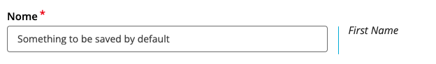
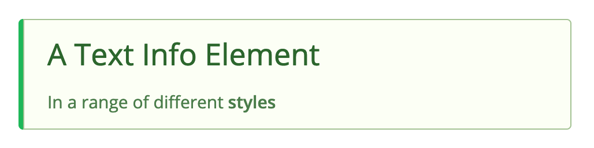
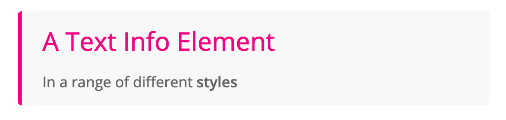
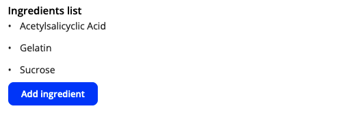

_Ongoing authoritative reference of Template Question/Element types, including input parameters and response type (shape). Please ensure this document matches the current implementation at all times._

## Contents <!-- omit in toc -->

<!-- toc -->

- [Template Element fields](#template-element-fields)
- [Question/Element types](#questionelement-types)
  - [Short Text Input](#short-text-input)
  - [Long Text (Multi-line) Input](#long-text-multi-line-input)
  - [Password Input](#password-input)
  - [Text Information](#text-information)
  - [Image Display](#image-display)
  - [Drop-down Selector](#drop-down-selector)
  - [Radio Buttons](#radio-buttons)
  - [Checkboxes](#checkboxes)
  - [File Upload](#file-upload)
  - [List Builder (Ingredients list)](#list-builder-ingredients-list)
  - [Search (Lookup)](#search-lookup)
  - [Date Picker](#date-picker)
  - [Number](#number)
  - [JSON Editor](#json-editor)
  - [Page Break](#page-break)

<!-- tocstop -->


<a name="element-fields"/>

## Template Element fields

These fields are common to all element types and have their own field in the `template_element` table.

- **id, section_id** : database references
- **code**: `string` -- unique (per template) identifier
- **index**: `integer` -- element ordering sequence (starting at `0`)
- **title**: `string` -- describes the element, shown in template builder (probably)
- **category**: `enum` -- either "Information" or "Question"
- **visibility_condition**: `JSON` -- dynamic query determining whether element appears to the user
  - default: `{"value": true}` (i.e. it always appears)
- **element_type_plugin_code**: `string` -- code of the question/element plugin that presents this element to the UI
- **is_required**: `JSON` -- dynamic query determining whether question is required to be answered
  - default: `{"value": true}`
- **is_editable**: `JSON` -- dynamic query determining whether can be edited (Would only be false in rare circumstances)
  - default: `{"value": true}`
- **initialValue**: `JSON` - this "initial value" response is evaluated *and saved* before anything is even exposed to the form element components, and so it must match the shape of the "response" values for the particular element type (see individual elements below). After that it behaves just like a normal question element. Most plugins also have their own **default** parameter which is evaluated when the element is rendered, so it can change in response to other changes and is *only saved after* the user loads the relevant page. Usually used when the default response depends on other elements responses.
Example for `shortText` plugin element:
```
{
  "text": "Something to be saved by default"
}
```


  Use cases for setting an `initialValue` over a `default` would be if you wanted to ensure that a particular element had a valid response in it before its page was even loaded, or if you want a hidden element to have a response without the user ever interacting with it (or even seeing it).
- **validation**: `JSON` -- a dynamic expression for checking if the user's response is a valid input.
  - default: `{"value": true}` or just `true`
- **validation_message**: `string` -- the message that shows in the UI when validation fails.  
  _TO-DO: Handle multiple validation criteria with different messages (eg. "Not a valid email", "Email is not unique")_
- **parameters**: `JSON` -- the parameters specific to each question/element type. See individual plugins below for parameter breakdown
- **is_reviewable**: `enum` -- either "ALWAYS", "NEVER" or `null`. If set to "ALWAYS", a review response will be created (i.e. a reviewer can review the question) even if there is no applicant response. If set to "NEVER", there will no review response created. This is useful (for example) for questions that are just used as logical conditions for other questions (e.g. "Is your postal address different"), and it can save the reviewer a lot of unnecessary clicking on content that is irrelevant to their actual review. The default for this field is `null`, in which case a review response is created whenever an application response is present.
- **showLiveParameters**: `boolean` (default `false`) -- Usually, when an application form is being edited, we store the result of any dynamic parameter values in the database, so that when viewed on the Summary page or in Review, subsequent users see the application as it looked when the applicant entered it. For example, if the application form displays user details of the applicant, we wouldn't want this to show the reviewer's details when they review it. So the current value of any dynamic parameters is saved along with the application responses. Then, in Summary and Review pages, we display these values rather than whatever they would evaluate to at the time. In the case where we *don't* want this (i.e the user should see up-to-date "live" values), set `showLiveParameters` to `true`.

  <a name="types"/>

## Question/Element types

**Note**: all parameter fields can also have a dynamic query object instead of a primitive. The [`evaluateExpression`](https://github.com/msupply-foundation/conforma-server/wiki/Query-Syntax) function will return literal strings (or numbers, booleans) as is. The types described for the parameters below are the type that is expected to be _returned_ from a query expression.

<a name="short-text"/>

### Short Text Input

- **type/code**: `shortText`
- **category**: `Question`

_Free-form, single-line text input element_

<a name="input-params" />

#### Input parameters (in the "parameters" JSON)

- **label**: `string` -- Text that shows in the HTML "label" attribute of the form element (Markdown string, with dynamic expression evaluation)
- **description**: `string` -- additional explanatory text (usually not required) [Optional]
- **placeholder**: `string`-- text to display before user input (HTML "placeholder" attribute) [Optional]
- **default**: `string` -- default response, will change dynamically in response to form changes until the user has edited it [Optional]
- **persistUserInput**: `boolean` -- if `false`, when the `default` value changes, the current response will be replaced by the new default. Otherwise (`true`), the default will only be used if there is no response yet. [Optional; default `false`]
- **ignoreNullDefault**: `boolean` -- if you have a dynamic default value, in some conditions you might want no default at all. In which case, you can configure it so that the default value is `null`. However, the component receiving this value doesn't know whether `null` means "reset the response to empty" or "ignore and leave it alone". By default, it will use the former, but in the cases where you want `null` defaults to be ignored, set this parameter to `true`.
- **maskedInput**: `boolean` -- if `true`, displays user input as masked (hidden) characters -- i.e. for passwords. [Optional]
- **maxWidth**: `number` -- the maximum width (in pixels) for the text input box (defaults to fill the width of the container)
- **maxLength**: `number` -- response must be no longer than this many characters. If the user tries to type more, the response will be truncated to the maximum length.  
   _Note_: if you want to show an error state for trying to exceed the maximum, you'll need to specify a validation expression with a REGEX operator, and the range will need to be one character less than the `maxLength`, so the error state is triggered. So to set limit of 100 characters, you'd set `maxLength` to 101 and use the following expression for "validation":
  ```
  {
  operator: "REGEX"
  children: [
    {
      operator: "objectProperties",
      children: [
        "responses.thisResponse"
      ]
    }
    "^[\\\\s\\\\S]{0,100}$"
  ]
  }
  ```

#### Response type

_This describes the expected object that will be stored in the `application_response` table `value` field from the user's response_  
`{ text: <string> }`

---

<a name="long-text"/>

### Long Text (Multi-line) Input

- **type/code**: `longText`
- **category**: `Question`

_Free-form, multi-line text input element_

#### Input parameters (in the `parameters` JSON)

- **label**: `string` -- Text that shows in the HTML "label" attribute of the form element (Markdown string, with dynamic expression evaluation)
- **description**: `string` -- additional explanatory text (usually not required) [Optional]
- **placeholder**: `string`-- text to display before user input (HTML "placeholder" attribute) [Optional]
- **default**: `string` -- default response, will change dynamically in response to form changes until the user has edited it [Optional]
- **persistUserInput** / **ignoreNullDefault**: See [above](#input-params)
- **lines**: `number` -- height of the TextArea input, in number of lines/rows (default: 5)
- **maxLength**: `number` -- response must be no longer than this many characters. If the user tries to type more, the response will be truncated to the maximum length. (See Note in ShortText above for how to integrate `maxLength` with validation.)

#### Response type

_This describes the expected object that will be stored in the `application_response` table `value` field from the user's response_  
`{ text: <string> }`

---

<a name="password"/>

### Password Input

- **type/code**: `password`
- **category**: `Question`

_Secure password input field, with enter-twice confirmation_

#### Input parameters (in the `parameters` JSON)

- **label**: `string` -- Text that shows in the HTML "label" attribute of the form element (Markdown string, with dynamic expression evaluation)
- **description**: `string` -- additional explanatory text (usually not required) [Optional]
- **placeholder**: `string`-- text to display before user input (HTML "placeholder" attribute) [Optional]
- **requireConfirmation** `boolean` -- if `true`, display a second input field for user to confirm their password (Default: `true`). The only time you would normally want to set this to `false` is when using a Password element to _check_ an existing password (by validating it against a `/login` endpoint, for example), such as in the UserEdit template.
- **confirmPlaceholder**: `string` -- text to display as placeholder in the password confirm input field [Default: `"Confirm password"`]
- **maskedInput**: `boolean` -- if `true`, displays user input as masked (hidden) characters -- i.e. for passwords. [Optional -- default `true`]
- **showPasswordToggle**: `boolean` -- if `true`, displays a checkbox to show the masked input as regular text [Optional -- default `true`]
- **validationInternal**: `JSON` -- a dynamic expression for checking if the user's response is a valid input. The validation method must be internal to the plugin (as opposed to the general "validation" field on all plugins) since the password is never exposed to the Wrapper, only the hash, so any checks on its validity must take place in the plugin's own validation method.
- **validationMessageInternal**: `string` -- the message that shows in the UI when validation fails. (For internal validation, as above)

Note that, as the password itself is never stored (only the hash), this fields input is reset if the page is reloaded.

#### Response type

_This describes the expected object that will be stored in the `application_response` table `value` field from the user's response_

```
{
  text: <string> (Only used to display '•••••••' on the summary page)
  hash: <string>
}
```

---

<a name="text"/>

### Text Information

- **type/code**: `textInfo`
- **category**: `Information`

_For displaying blocks of text in the application_

#### Input parameters

- **title**: `string` -- Heading text to display [Optional]
- **text**: `string` -- body text to display
- **style**: `string` -- a range of present visual styles [Optional]. Options are: `none` (default), `basic`, `info`, `warning`, `success`, `positive`, `error`, `negative`  
  (see screenshots below)
- **newTabLinks**: `boolean` -- `true` forces any hyperlinks in the Markdown text to open in a new tab [Optional] (default: `true`)

**Note**: `title` and `text` strings support basic [**Markdown**](https://en.wikipedia.org/wiki/Markdown) formatting

#### Style options

#### `style: none` (default)


#### `style: basic`


#### `style: info`


#### `style: warning`


#### `style: success`



#### `style: positive`


#### `style: error`



#### `style: negative`


---

<a name="image"/>

### Image Display

- **type/code**: `imageDisplay`
- **category**: `Information`

_For displaying images in applications_

#### Input parameters

- **label**: `string` -- Label for image (above) [Optional]
- **description**: `string` -- Detailed text [Optional]
- **url**: `string` -- URL of the source image file
- **size**: `string` -- From SemanticUI "size" parameter, one of the following values: `mini`, `tiny`, `small`, `medium`, `large`, `big`, `huge`, `massive` (default `medium`)
- **alignment**: `string` -- one of `left`, `center`, `right` (default `left`)
- **altText**: `string` -- text for the HTML `alt` and `title` attributes (will show as tool-tip) [Optional]

---

<a name="dropdown"/>

### Drop-down Selector

- **type/code**: `dropdownChoice`
- **category**: `Question`

_Multi-choice question, with one allowed option, displayed as Drop-down list (Combo-box)_

#### Input parameters

- **label**: `string` -- as above
- **description**: `string` -- as above [Optional]
- **options**: `array[string | object]` -- array of options for the user to select from. If an array of **strings** is provided, these strings will be displayed to the user. However, if an array of **objects** is provided, you will also need to specify an `optionsDisplayProperty` (see below)
- **default**: `string`/`number` -- can be either a string representing the *value*, or a number representing the index in the `options` array. [Optional]
- **persistUserInput** / **ignoreNullDefault**: See [above](#input-params)
- **search**: `boolean` (default: `false`) -- if `true`, the list of options can be searched and filtered by user
- **optionsDisplayProperty**: If `options` (above) consists of an array of objects, this parameter specifies the field of each object to be displayed in the options list. For example, if `options` was a list of organisation objects (i.e. `{orgId, name, licenceNumber}`), you'd probably specify `name` as the `optionsDisplayProperty`. Note that even though one field is displayed to the user in the Dropdown list, the _entire_ selected object is saved as the selection. And if `optionsDisplayProperty` refers to a field that doesn't exist on the supplied object, the plugin will fail and show in error in the application.
- **optionsDisplayExpression**: Similar to `optionsDisplayProperty`, but you can build a display string out of multiple object properties, using the same substitution/templating mechanism as the [listBuilder](#list-builder-ingredients-list) `displayFormat` property.
- **hasOther**: `boolean` (default `false`) -- if `true`, allows the user to enter a custom "free text" value instead of one of the pre-defined options.
- **multiSelect**: `boolean` -- whether or not the user can select multiple items for their response (default: `false`)

Note: if including an "Other" options, then options should only be an array of strings, or else you'll be mixing objects with strings, which will cause problems. In other words, you should never have both optionsDisplayProperty and hasOther defined in the same question element.

#### Response type

For single response configurations (`multiSelect = false`):
```
{
  optionIndex: <integer> (index from the options array)
  text: <string> (actual text from options array)
  selection: <string | object> (entire object or string from the supplied options list)
  isCustomOption: <boolean> (if the selection is a custom "hasOther" option)
}

```

For multiple response configurations (`multiSelect = true`):
```
{
  optionIndex: array[<integer>] (indexes from the options array)
  text: <string> (concatenation of selected text values from options array)
  selection: array[<string | object>] (array of selected objects or strings from the supplied options list)
  isCustomOption: <boolean> (if the selection includes a custom "hasOther" option)
}

```

---

<a name="radio"/>

### Radio Buttons

- **type/code**: `radioChoice`
- **category**: `Question`

_Multi-choice question, with one allowed selection, displayed as labelled radio buttons_

#### Input parameters

- **label**: `string` -- as above
- **description**: `string` -- as above [Optional]
- **options**: `array[string | object]` -- as above (in [Drop-down](#dropdown))
- **default**: `string`/`number` -- the value initially selected before user input. If `number`, refers to the index of the options array. If not provided, no options will be pre-selected.
- **persistUserInput** / **ignoreNullDefault**: See [above](#input-params)
- **optionsDisplayProperty**: -- as above (in Drop-down)
- **layout**: `string` -- if "inline", displays radio buttons horizontally, rather than stacked vertically (default)
- **hasOther**: `boolean` (default `false`) -- if `true`, displays an additional "Other" option with a free text field for inputting additional user-defined option.
- **otherPlaceholder**: `string` -- placeholder text to show in the text input if `hasOther` is enabled.

  **Note**: if including an "Other" options, then `options` should only be an array of strings, or else you'll be mixing objects with strings, which will cause problems. In other words, you should never have both `optionsDisplayProperty` and `hasOther` defined in the same question element.

#### Response type

```
{
  optionIndex: <integer> (index from the options array)
  text: <string> (actual text from options array)
  selection: <string | object> (entire object or string from the supplied options list)
  other: <boolean> (`true` if "Other" has been selected)
}

```

---

<a name="checkbox"/>

### Checkboxes

- **type/code**: `checkbox`
- **category**: `Question`

_One or more checkboxes, any number of which can be selected/toggled_

#### Input parameters

- **label**: `string` -- as above
- **description**: `string` -- as above [Optional]
- **checkboxes**: `array[string | checkbox]` -- an array of labels, one per checkbox. For more complexity, an array of Checkbox objects can be provided, with the following properties:

```
{
  label: <string> - text to display next to checkbox (Can be empty string but not omitted)
  text: <string> - value to store in Response "text" field and shown in Summary View. Will be same as label if omitted.
  textNegative: <string> - value to store in Response "text" field if checkbox is un-selected. (Optional -- defaults to empty string)
  key: <string | number> - unique code used as key/property name for Response object. Defaults to numerical index of array if omitted
  selected: <boolean> - initial state of checkbox
  ...Other properties
}
```  
"Other properties" refers to any additional properties included in the object. For example, an API call might return objects with a bunch of additional fields. These are not required for the Checkbox display, but will be passed along and stored as part of the response, so any of these properties can be referred to in subsequent elements or actions.

To handle objects returned that don't have the required fields, you can use the `keyMap` parameter (below) to map fields to required key names.

- **type**: `string` -- Can be "toggle" to display as a toggle switch, or "slider" to display as a slider switch (defaults to regular checkbox).
- **layout**: `string` -- if "inline", displays checkboxes horizontally in rows. Useful if there are a lot of checkboxes.
- **resetButton**: `boolean` -- if `true`, element will show a "Reset" button, which allows user to reset selections to the initial (loading) state. (Default: `false`)
- **displayFormat**: (Options: `text`, `list` (default), `checkboxes`, `propertyList`) -- specifies how to show the applicant's response on the Summary page:
  - `list`: shows the selected checkboxes in a (Markdown) list
  - `text`: shows the selected values in a comma-separated text string
  - `checkboxes`: displays the selected values as checkboxes as per the application view
  - `propertyList`: displays in a list with properties (the checkbox `label` field) and values (the checkbox `text` or `textNegative` values, depending on selection).  
  e.g.
    - Option1: YES
    - Option 2: NO
    - \<checkbox `label`\>: \<`text`\/`textNegative` value\>  
Note: this display option is only suitable if you have separately defined `label`, `text` and `textNegative` fields for each checkbox.
- **preventNonResponse**: `boolean` (default `false`) -- normally, we want to allow the user to leave checkboxes unchecked and be considered a valid response. However, if we want to force the user to tick a box (e.g. for a declaration, say), then set `preventNonResponse` to `true`. Note that `isRequired` must be `true` for this element for this parameter to have an effect.
- **keyMap**: `object` -- if the input `checkboxes` property (above) has different property names that what is required (for example, if pulling from an API), then this `keyMap` parameter can be used to re-map the input property names to the required property names. For example, if your input "checkbox" data contained an array of objects of the type `{ name: "Nicole", active: true}`, you would provide a `keyMap` object like this:

```
{
  label: "name",
  selected: "active"
}
```  
This tells the element to look at the "name" field for the `label`, and the "active" field for the `selected` status. Note that all the "checkbox" fields can be re-mapped, but it is only required that you provide the ones that are different.
- **default**: `string |  string[] | Checkbox[] | {key: Checkbox...}`  -- the "default" value works a bit differently to most of the other elements, as checkbox values can already be dynamically controlled by updating the `checkboxes` parameter and changing the `selected` value within each. However, this `default` value is more flexible in what it can take as input. In particular, it can take a comma-delimited string (or array of strings), which will be converted to checkboxes whose `selected` values are set to `true` if the Checkbox `text` (or `label` if `text` not specified) value is included in the string.  
e.g. If the default value is = `"Medicine, Chemical"`, and the `checkboxes` are: `["Chemical", "Poisons", "Medicine"]`, then the element will be instantiated with two of the three checkboxes already checked. There are some subtle differences in how the `default` value responds to dynamic changes (e.g. as a result of other elements) as compared to `checkboxes`, but this should be apparent when configuring/testing the template.
- **hasOther**: `boolean` (default `false`) -- if `true`, allows the user to enter a custom "free text" value instead of one of the pre-defined options.
- **otherLabel**: `string` (default `"Other"`) -- if `hasOther` is `true`, this is the label text for the new text input.
- **otherPlaceholder**: `string` (default `"Enter other value"`) -- if `hasOther` is `true`, this is the placeholder text that appears in the input field before any user input.

#### Response type

```

{
    text: <string> -- comma separated list of all selected checkbox "text" 
    textUnselected: <string> -- comma separated list of all unselected checkbox "text"
    textMarkdownList: <string> -- selected text values formatted as a Markdown list
    textUnselectedMarkdownList: <string> -- unselected text values formatted as a Markdown list
    textMarkdownPropertyList: <string> -- all checkboxes displayed as a Markdown <label>: <text/textNegative> list (see "textDisplay -> propertyList" above)
    values, shown in Summary view (or Review)
    values: {
        <key-name-1> : { text: <text value>, isSelected: <boolean>}
        <key-name-2> : { text: <text value>, isSelected: <boolean>}
        ... for all checkbox keys
        }
    ...Other properties
    selectedValuesArray: [
      <checkbox elements -- same as the values above but filtered for selected-only>
    ],
    unselectedValuesArray: [
      <checkbox elements -- same as the values above but filtered for UNselected-only>
    ]
}

```

---

<a name="file"/>

### File Upload

- **type/code**: `fileUpload`
- **category**: `Question`

_Interface for uploading documents or other files_

#### Input parameters

- **label**: `string` -- as above
- **description**: `string` -- as above [Optional]
- **fileCountLimit**: `number` -- maximum number of files allowed to upload for this question (default: 1)
- **fileExtensions**: `array[string]` -- list of allowed file extensions (default: no restrictions). e.g. `["pdf", "doc", "txt", "jpg", "png"]`
- **fileSizeLimit**: `number` -- maximum file size in KB (default: no limit)
- **subfolder**: `string` -- by default, files are uploaded into a subfolder with the name of the application serial. However, this can be over-ridden by specifying this parameter. This should rarely be required.
- **showDescription**: `boolean` -- if `true`, an additional text input will be displayed alongside each file to allow the applicant to specify a description for each file. (default `false`)
- **showFileRestrictions**: `boolean` -- will display the allowed file extensions and maximum size below the upload box (default: `true`)
- **showDocumentModal**: `boolean` -- if `true`, will display documents (when clicked to view) in a modal overlay rather than opening in a new tab. Will fallback to global system preference.

#### Response type

Response object is populated after file upload, based on the server response. Note: only successful uploads are included in the response. Error files or files currently loading are displayed in the UI but filtered out before saving.

```

{
  text: <string> -- comma separated list of all filenames
  files: [
    {
      filename: <string>
      fileUrl: <string>
      thumbnailUrl: <string>
      mimetype: <string>
    },
    ...
  ]
}

```

---

<a name="list-builder"/>

### List Builder (Ingredients list)

- **type/code**: `listBuilder`
- **category**: `Question`

_Allows user to build a list of items, such as an **Ingredients List**_

#### Input parameters

- **label**: `string` -- as above
- **description**: `string` -- as above [Optional]
- **default** `ResponseList` -- default value for the list. Must be in the format of the `list` parameter from the Response object (i.e. an array of objects)
- **persistUserInput** / **ignoreNullDefault**: See [above](#input-params)
- **createModalButtonText** `string` -- text to display on the button to launch the new item interface (modal) (default: "Add item")
- **addButtonText** `string` -- text to display on the button to add a new item from the item editing modal (default: "Add")
- **updateButtonText** `string` -- text to display on the button to update an existing item from the item editing modal (default: "Update")
- **deleteItemText** `string` -- text to display on the button to delete an item from the item editing modal (default: "Update")  
  Note: this button only appears when displaying the list in "Table" view (see below). In "Cards" view, there is an icon to delete items directly on each card.
- **modalText** `string` -- additional instructional text to show on the item editing modal (e.g. "Please enter ingredient details") [Optional]
- **inputFields** `array[Elements]` -- an ordered list of input fields -- these are template questions/elements, just like all the ones on this page, but are "children" of the listBuilder element and display in the item editing modal. Not all fields are required or respected:

  - `index` -- not required, order follows listed order
  - `visibility_condition` / `is_editable` -- not required, always `true` (for now, may be implemented later)
  - `parameters`, `title`, and `code` are essential

- **maxItems** `number` -- if specified, the maximum number of items that can be added to the list (once this number is reached, the "Add" button will no longer appear)
- **displayType** `'table' | 'cards' | 'inline' | 'list'` (default: `cards`) -- how to present the list of items, as shown here:

  - **table** view:

    

    For table view, the column headers are taken from the **title** fields of each element

  - **card** view:

    

    The display string(s) for card view are defined in the `displayFormat` field (below)

  - **inline** view:

    

    The input form is displayed inline (i.e. no modal), and can be collapsed/opened for each item

  - **list** view:

    

    A simple view, best for when each item only has one field


- **displayFormat** `object` (only relevant for **card** view) -- defines how to present the input information on the displayed cards. The object defines three fields, representing the Title/Heading (`title`), the Subheading (`subtitle`) and Body (`description`).  
  Each is a **Markdown** formatted string, with the values to be substituted from the input `text` values represented by their element `code` wrapped in `${...}`. An example `displayFormat` object representing the card layout shown above is:

  ```
  {
    title: "\${LB1}"
    subtitle: "\${LB2}"
    description: "**Quantity**: \${LB4} \${LB5}  \\n
        **Substance present?**: \${LB3}  \\n**Type**: \${LB6}"
  }
  ```

  where `LB1`...`LB6` are the element codes from the template. (Note, also, the additional escape `\` characters required if used inside a GraphQL query string)

  If a `displayFormat` parameter is not specified, the card view will just show a simplified list of fields representing `title: value` for each input.
- **textFormat** `string` -- (optional) a formatting substitution string like the above, to be generate the "text" value in the response. This substitution string is *per item* and will generate a single string broken up by line breaks for each item. For example, if you have a list (of items with the above fields), you could define a `textFormat` like so:  
  `${LB4} mg`  
  And the output text string (with a 3-item list) would be something like:  
  `"12 mg\n65 mg\n10mg"`
  
  Note that the `text` display for list builders is rarely required, perhaps only useful for display in a [Data View](https://github.com/msupply-foundation/conforma-server/wiki/Data-View) or similar output. The default formatting (comma-separated list of `<title>: <text value>`) is probably fine for most purposes.
- **dataFormat** `string | EvaluatorExpression` (optional) The array of responses (each listBuilder item) can be converted to a more easily-digestible set of values (as opposed to the full `list` object -- see [Response](#response-type-7) below). This can make it easier for outputting to a data table, perhaps, or be more easily displayed in a [Data View](https://github.com/msupply-foundation/conforma-server/wiki/Data-View). The `dataFormat` value uses the `textFormat` value by default -- the difference is it creates an array of formatted strings rather than a single concatenated string for the text value. If you wish to specify something different to the `textFormat`, you can provide another substitution string, or a complete [evaluator expression](https://github.com/msupply-foundation/conforma-server/wiki/Query-Syntax) for something more complex. The `objects` property for the evaluator consists of the usual `currentUser`, `applicationData`, `responses`, `functions` objects, as well as an `item` object which changes with each item in the list builder.  
  The example substitution string from `textFormat` (above) would yield a data object of:  
  `[ "12 mg", "65 mg", "10mg" ]`

  This is the equivalent of the full evaluator expression:
  ```
  {
    "operator": "stringSubstitution",
    "children": [
      "%1 mg",
      {
        "operator": "objectProperties",
        "children": [
          "item.LB4",
          null
        ]
      }
    ]
  }
  ```
  A simple text substitution string is probably adequate for most purposes. An evaluator expression would be useful when you want to save your `data` as something other than `string`s, or for very fine-grained control over the construction of each response item.
- **inlineOpen** `boolean` (only relevant for **inline** view) -- if `true`, all elements will be displayed "open" (i.e. not collapsed) on initial load (default `false`)
- **tableExcludeColumns** `string[]` (only relevant for **table** view) -- an array of Input Field (aboves) `code`s to exclude from the table view, which can be useful when there are a lot of fields being collected which can make the table overly cluttered.  
  
  *The following properties only apply to **Table** view and only when viewing on a Mobile display. When displaying on a mobile device, tables get "collapsed" so that each row becomes a "cell", with a stack of labels and values. This makes it possible to view table data on a narrow display without arduous side-scrolling.*
- **hideFromMobileIfEmpty** `boolean | string[]` -- to save space, if a particular field has no value, we can hide it completely. Put the `code` of any input field that should be treated like this into an array. Or, if the parameter is just set to `true`, the rule will be applied to *all* fields (default `false`)
- **minMobileLabelWidth** `number | string` -- set a minimum width for the labels within the mobile table. This can help with alignment the values visually. (Can be any valid CSS value, e.g. `150`, `"200px"`, `"50%"`)
- **maxMobileLabelWidth** `number | string` -- same as above, but a max label width. Labels will wrap onto a new line if they exceed this width.

#### Response type

```

{
  list: [
    {
      <code> : {
                value: <Response object (text, etc, as per other elements)>,
                isValid: <boolean>
                },
                ...
    },
    ...
  ],
  text: <simple text representation of a list of comma-separated
        "title: value" rows>,
  data: [ <array of response values as specified in "dataFormat" parameter> ]
}

```

**Notes**:

- the `text` value is never actually presented to the user.
- the `isValid` field should always be `true` when the response is saved, since items won't be permitted to be added to the list if all input fields are not valid. There is currently no additional validity checking of the responses after they've been entered into the list, although this might be improved in future.

---

<a name="search"/>

### Search (Lookup)

- **type/code**: `search`
- **category**: `Question`

_Live "search-as-you-type" lookups for user to find and select items_

Search results show in pop-up below the search box:


Once selected, items are displayed in a "card" view:


#### Input parameters

- **label**: `string` -- as above
- **description**: `string` -- as above [Optional]
- **placeholder**: `string` -- text to show in search field before user input (default: "Search...")
- **source**: `EvaluatorExpression` -- query to retrieve results for user selection. In order to make this dynamic in response to user input, there should be at least one input node that uses an `objectProperties` operator to fetch user input. In this case, user input is contained within a special object named `search`, and can be acquired with the following query node:

  ```
  {
    operator: "objectProperties",
    children: [ "search.text" ]
  }
  ```
- **default** `ResponseSelection` / `ResponseSelection[]` -- default value for the selection(s). Must be in the format of the `selection` parameter from the Response object (i.e. an array of objects), or just a single object if not multi-select.
- **persistUserInput** / **ignoreNullDefault**: See [above](#input-params)
- **icon**: `string` -- the name of the icon shown in the search box, from Semantic-UI icons. (default: "search" : 🔍 )
- **multiSelect**: `boolean` -- whether or not the user can select multiple items for their response (default: `false`)
- **minCharacters**: `number` -- the minimum number of characters the user must type before the search query executes (default: 1). This is useful in situations where need the user to look up a specific item without being able to freely browse through the entire results list. For example, to look up organisation in our system using "registration" code, we set `minCharacters = 6`, so the user will need to know an exact code rather than being able to try characters one at a time.
- **restrictCase**: `"upper" | "lower"` -- if specified, all user input will be automatically converted to the specified text case.
- **trimWhiteSpace**: `boolean` -- if `true`, user won't be able to enter spaces in search query (default: `false`)
- **displayFormat**: `object` -- defines how to display the search results and the user's selection cards. See `displayFormat` for the [List Builder](#list-builder) (above) for detailed explanation. In this case, however, instead of a `code` substitution, the display string should contain property names from the result object. For example:
  ```
  displayFormat: {
    title: "\${firstName} \${lastName}"
    description: "\${username}"
  }
  ```
  If not specified, a generic "default" display will be shown, using the first 1-2 properties on the result object.
- **displayType**: `"card" | "list" | "input"` (default: `card`). "card" view will display each result as a simple Semantic [card](https://react.semantic-ui.com/views/card/), using the fields provided in `displayFormat`.  
  For "list" view, the results will show as a simple text list, and only one of either `title` or `description` will be used (`title` has priority). This is useful when there is only one field in the results, in which case a "card" view can look inappropriate.  
  "input" is even simpler than list -- only a single text result can be displayed, but it will show the selected value in the input/search field itself. And like "list", it uses the `displayFormat` to define how to present the selection.
- **resultFormat**: `object` -- same as `displayFormat`, but used when specifying a format for the "result" display that is different to the selection card display. If not specified, `resultFormat` will just be the same as `displayFormat`.
  Note that for the "result" display, only the `title` and `description` fields are used (`subtitle` is not shown).
- **textFormat** `string` -- a formatting substitution string like the above, to be generate the "text" value in the response. Note: currently the only place this text value is ever seen by the user is if it's used inside a listBuilder table (optional)
- **inputPattern**: `string (regex)` -- if specified, the user search input must conform to this Regex pattern. For example `^[0-9]{9}[A-Z]{2}[0-9]{3}$` would require user to enter 9 digits followed by 2 uppercase letters, then 3 more digits. If the user deviates from this, an error message will be displayed.
- **inputExample**: `string` -- one problem with the above `inputPattern` is that we need to make sure that we don't show an input error while the user is in the process of entering text, even though their partial input (probably) won't yet comply with the required pattern. As a workaround for this, we supply an `inputExample` here, which is a valid example that matches the pattern. For the above example pattern, a valid value could be `"123456789XY666"`. The element then internally uses a combination of the user input and this example to validate against the regex pattern.
- **inputErrorMessage**: `string` -- if user input doesn't match the specified `inputPattern` this message will displayed as the error. If not provided, we use a generic default ("Invalid input pattern").
- **searchErrorMap**: `object` -- when searching, the server may return an Error with a range of different possible messages. You can translate these errors into more user-friendly messages by providing a key-value map from the server error message to what you want displayed. Note that the error key only has to match the *start* of the message, e.g. if you have the entry `"External API error": "The external server failed to respond"`, and the server responds with `"External API error: 404 error"`, then this entry will still match. (When no match is found, the original error string is displayed unmodified)

#### Response type

```

{
  selection: [ { <result object> }, ... ],
  text: <JSON string representation of "selection">
}

```

---

<a name="date-picker"/>

### Date Picker

- **type/code**: `datePicker`
- **category**: `Question`

_A date picker for entering standardised dates or date ranges_


Uses [React Semantic-UI Datepickers](https://www.npmjs.com/package/react-semantic-ui-datepickers)

#### Input parameters

- **label**: `string` -- as above
- **description**: `string` -- as above [Optional]
- **default**: `(ISO) string` -- a pre-selected date [Optional]
- **persistUserInput** / **ignoreNullDefault**: See [above](#input-params)
- **allowRange**: `boolean` -- if `true`, input is expected to be a date _range_ (a start and end date). Default: `false` (i.e. can only enter single date)
- **minDate**/**maxDate**: `(ISO) string` -- specifies how far into the future or past the selector can go
- **minAge**/**maxAge**: `(ISO) string` -- same as above, but a number (in years) relative to the _current_ date. For example, if an applicant was required to be over 18 years old, you'd set `minAge` to `18`.
- **locale**: `string` -- specifies the international "locale" code (e.g `'ja-JP'`) for displaying the calendar in local format. Default is `'en-US'`.
- **displayFormat**: `string` -- how to present the date when written as text (e.g. in Summary view). Uses [Luxon](https://moment.github.io/luxon/#/formatting) shorthand -- options are: `short`, `med`, `medWeekday`, `full`, `huge` *or* you can specify a tokenised string for more specificity (e.g. `'yyyy LLL dd'`). Will format according to the international standard specified in `locale`. Default: `short`
- **entryFormat**: `string` -- date format to expect when user enters a date manually (rather then selecting from the picker) in [date-fns](https://date-fns.org/v1.29.0/docs/format) format. Default is `YYYY-MM-DD`
- **firstDayOfWeek**: `string` -- self explanatory, default is "Sunday"

#### Response type

```
{
text: <text format of date (range) as specified in "displayFormat">
date: {
    start: <ISO YYYY-MM-DD date>
    end?:  <ISO YYYY-MM-DD date>
  }
}
```

Note, if response is a single date (i.e. not a range), only `start` will be specified.

---

<a name="number"/>

### Number

- **type/code**: `number`
- **category**: `Question`

_Input for numeric fields_

#### Input parameters

- **label** / **description** / **placeholder** / **maxWidth**: `string` -- as above
- **default**: `string`/`number` -- default value 
- **persistUserInput** / **ignoreNullDefault**: See [above](#input-params)
- **type** -- `enum` -- either "integer" or "float" (default: "integer")
- **simple** -- `boolean` (default: `true`) If `true`, the input field will always show only a non-formatted version of the number (i.e. "1000", not "1,000"), but it will have a "stepper" which can be clicked to increment the number up and down.
- **minValue** -- minimum allowed value (default: 0)
- **maxValue** -- maximum allowed value (default: no limit)
- **step** -- `number` (default: `1`) If `simple == true` (above), the `step` value specifies the amount the number will be incremented or decremented by when using the stepper.
- **prefix** / **suffix** -- `string` If specified, the number will display these values either side of the number input. They'll also be pre/appended to the "text" representation of the number in the saved response. Useful if you want to define units with the input number (e.g. `12 km`)
- **suffixPlural** -- `string` (only relevant if `suffix` is specified above) Changes the displayed/stored suffix depending on the value of the number based on pluralisation rules.  
(e.g. if `suffix = "month"` and `suffixPlural = "months"`, then when number is 1: "1 month", when number is 2:  "2 months")  
**NOTE**: The parameters below are only relevant if `simple == false` (above). They also only apply to the *formatting* of the number, not the number value itself.
- **locale** -- `string` specifies the international "locale" code (e.g `'ja-JP'`) for displaying the number in local format. Default is the local setting.
- **currency** -- `string` If specified, number will be formatted as a currency value (e.g. $4.95). Should be specified in ISO4217 country code format (e.g. "USD", "JPY") See: [https://www.iban.com/currency-codes](https://www.iban.com/currency-codes)
- **maxSignificantDigits** -- `number` If specified, number will be rounded to the specified number of significant figures
- **decimals** -- `number` If specified, number will be displayed with exactly this many decimal places.

#### Response type

```
{
  text: <Formatted version of number (as specifed in parameters)>
  number: <number>
  type: <integer | float>
  currency: <string> (from parameters, only stored if defined)
  locale: <string> (from parameters, only stored if defined)
  prefix: <string> (from parameters, only stored if defined)
  suffix: <string> (from parameters, only stored if defined)
  suffixPlural: <string> (from parameters, only stored if defined)
}
```

---

<a name="json-editor"/>

### JSON Editor

- **type/code**: `jsonEdit`
- **category**: `Question`

_Editor/Viewer for raw JSON data_

Uses [json-edit-react](https://carlosnz.github.io/json-edit-react/)


#### Input parameters

- **label** / **description** `string` -- as above
- **default**: `string`/`number` -- default value (JSON object)
- **persistUserInput** / **ignoreNullDefault**: See [above](#input-params)
- **width**: `number` -- sets the max width (in pixels) for the editor. (It will also be limited by the size of the container, so won't extend of the screen in mobile)
- **preventEditFields**: `string[]` -- a list of field names that should be editable by the user. For example, if editing a database record, the `id` field should probably not be editable.
- **allowEditDepth**: `number` -- how deep in the JSON structure to allow editing. If this is `1`, then only the top-level fields can be modified. To prevent *all* editing (i.e. just for viewing), set this to `0`
- **allowAddDepth**: `number` -- same as `allowEditDepth`, but for *adding* new properties
- **allowDeleteDepth**: `number` -- same as `allowEditDepth`, but for *deleting*  properties
- **collapse**: `number` (default `1`) -- the depth at which the JSON view will be "opened" to on first loading. If set to `0`, the whole thing will start in a "closed" state.
- **canChangeType**: `boolean` (default `false`). This prevents the user from changing the data type of a field, which could cause problems if trying to update the database with it. Note that `null` values can still be changed to other types, so be careful with this.
- **showSearch**: `boolean` (default `false`). If `true`, a "search" input will be visible on the editor for narrowing down the list of properties visible.
- **...jsonProps**: all the properties for configuring the Json editor component can also be provided for additional customisation. See [json-edit-react docs](https://github.com/CarlosNZ/json-edit-react#props-overview) for details.


#### Response type

```
{
  text: <Stringified version of the data object>
  data: { ...JsonData }
}
```

---

<a name="page"/>

### Page Break

- **type/code**: `pageBreak`
- **category**: `Information`

_For specifying where the list of questions is broken into UI pages/steps. The **previous** question of this element will be the **last** element on a page_

#### Input parameters

- ~~**pageBreakValidityCheck**: `boolean` -- If `true`, the user cannot proceed to the next page unless _all_ questions on the current page have passed validation~~
  - ~~default: `false`~~

