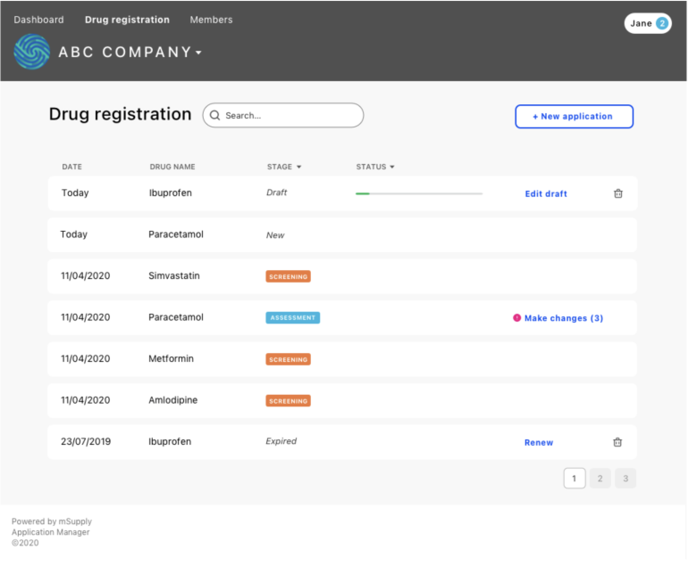
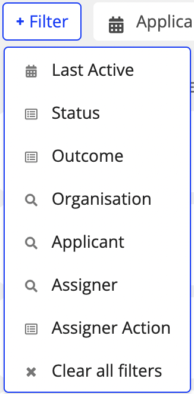
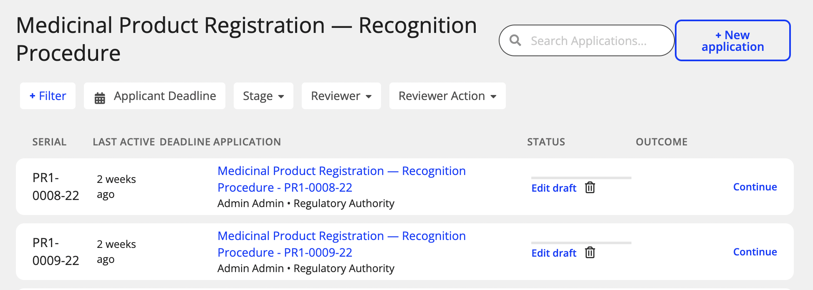
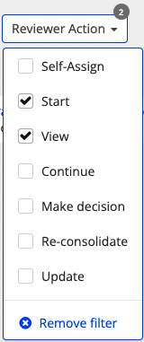

## Contents <!-- omit in toc -->
<!-- toc -->
- [Overview](#overview)
- [Examples: UI Design](#examples-ui-design)
- [Filters](#filters)
  - [Label filters:](#label-filters)
  - [applicant action](#applicant-action)
  - [String filters:](#string-filters)
  - [Date filters:](#date-filters)
  - [Number filters:](#number-filters)
  - [Boolean filters](#boolean-filters)
- [Formats \& Rules](#formats--rules)
  - [Pre-defined dates](#pre-defined-dates)
  - [Strings](#strings)
  - [Labels](#labels)
  - [General](#general)
<!-- tocstop -->
## Overview

The list of applications to display for the current user is based on:

- its permissions to view a certain group of applications
- the application type (aka template code)
- other optional filters selected

The user has access to links to see each type of application list from the top menu or from their dashboard - the link will set basic filters in the main URL route of the list: `/applications`.
For example to see the list of Applications for "Drug Registration" applied by you has this link: `/applications?type=user-registration&user-role=applicant`.

The `type` is the template code related to the applications type to be listed.
The `user-role` is used to determine which columns should be displayed.
In this example the user has **applicant** role. The user-role can only be `applicant` or `reviewer` and is deduced from the permissions that the current user has to view this application type.

## Examples: UI Design

---

## Filters

The file `applicationFilters` on the frontend controls the settings for how filters are displayed. They use the localised string to show keys and values to be selected.

A dropdown is displayed for the user by clicking on the option displayed on the top of the Applications list:

Each filter type can be selected by the user, it will be displayed on the right alongside to others previously selected. Some filters, already defined with property `default` set to true will be already available in the top area:

The user can select the value to filter by after clicking on one of the filter and check one or more of the options that are displayed:

 
 
---

### Label filters:

#### type

**This is a compulsory filter**
In case no `type` is included in URL, the type will be deduced from 1st user's persmissions.

Included: **Yes**
Can have combined values: **No**
Examples: `type=user-registration`
After is converted to Graphql: `templateCode: { equalToInsensitive: user-registration}`

#### category (_not yet implemented in schema_)

Included: **No** [Epic#82](https://github.com/openmsupply/conforma-web-app/issues/540)  
Can have combined values: **No**  
Examples: `category=company`  
After is converted to Graphql: **TODO**

#### stage

Included: **Yes**
Can have combined values: **Yes**  
Examples: `stage=screening` or `stage=screening,assessment`
After is converted to Graphql: `stage: { inInsensitive: ["screening", "assessment"]}`

#### status

Included: **Yes**
Can have combined values: **Yes**
Examples: `status=draft` or `status=submitted,changes%20required`
After is converted to Graphql: `status: {in: ["SUBMITTED", "CHANGES_REQUIRED"]}`
Options: Set of static statuses from ApplicationStatus ENUM

- `draft` or `DRAFT`
- `submitted` or `SUBMITTED`
- `changes-required` or `CHANGES_REQUIRED`
- `re-submitted` or `RE_SUBMITTED` _not implemented_
- `completed`or `COMPLETED`

#### sort-by

Included: **Yes**
Can have combined values: **Yes**
Examples: `sort-by=stage:asc` or `sort-by=stage:asc,application-name:desc`
Options:

- `column-name:direction`
- direction [Optional] `asc`/`desc`
- if no direction is included use default: `desc`

#### user-role

**This is a **compulsory** filter.**
In case no `user-role` is included in URL, the role will be deduced from permission of type in user's persmissions.

Included: **Yes**
Can have combined values: **No**  
Examples: `user-role=applicant`  
Options:

- Deduced by user's permissions (**TODO: More detailed explanation of user-role per permissions**)

#### outcome

Included: **Yes**
Can have combined values: **Yes**
Examples: `outcome=pending` or `outcome=pending,approved`
After is converted to Graphql: `outcome: {in: ["PENDING"]}`
Options: Set of static `outcome` from `ApplicationOutcome` ENUM

- `pending` or `PENDING`
- `approved` or `APPROVED`
- `rejected` or `REJECTED`

### applicant action

The applicant actions are simpler and deduces in Front-end based
on current Application status. 
Included: **Yes**
Can have combined values: **No**
Examples: 
- `ACTION_UPDATE` meaning some changes for applicant to take care (after reviewed) and re-submit.
- `ACTION_CONTINUE` meaning application in in Draft - either before submission or after started updating

Options:
- `ACTION_UPDATE`
- `ACTION_CONTINUE`
- Default `VIEW` (Submitted)

#### assigner action

Check out in schema `AssignerAction` ENUM and Function `assigner_list`
Included: **Yes**
Can have combined values: **No**
Examples: `assigner-action=ASSIGN` or `assigner-action=RE_ASSIGN`
After is converted to Graphql: `assignerAction: {equalTo: "RE_ASSIGN"}`
Options:

- `ASSIGN`
- `RE_ASSIGN`

#### reviewer action

Check out in schema `ReviewerAction` ENUM and Function `review_list`
Included: **Yes**
Can have combined values: **No**
Examples: `reviewer-action=start_review` or `reviewer-action=CONTINUE_REVIEW`
After is converted to Graphql: `reviewerAction: {equalTo: "CONTINUE_REVIEW"}`
Options:

- `SELF_ASSIGN`
- `START_REVIEW`
- `CONTINUE_REVIEW`
- `MAKE_DECISION`
- `RESTART_REVIEW`
- `UPDATE_REVIEW`
- `VIEW_REVIEW`

---

### String filters:

#### reviewer

Included: **Yes**  
Can have combined values: **Yes**  
Examples: `reviewer=testReveiwer2` or `reviewer=testReveiwer2,testReviewer1`
After is converted to Graphql: `reviewerUsernames: { overlaps: ["testReviewer2", "testReviewer1"]}`
Options:

- `"username"` - Reviewer's username

#### assigner

Included: **Yes**  
Can have combined values: **Yes**
Examples: `assigner=testAssigner1` or `assigner=testAssigner1,Nicole`
After is converted to Graphql: `assignerUsernames: { overlaps: ["testAssigner1", "Nicole"]}`
Options:

- `"username"` - Assigner's username

#### applicant

Included: **Yes**
Can have combined values: **Yes**
Exmples: `applicant=Andrei E` or `applicant=Andrei E,Nicole M`
After is converted to Graphql: `applicant: { inInsensitive: ["Andrei E", "Nicole M"]}`
Options:

- `username`
- `firstName`
- `lastName`
- fullName: `firstName lastName`

#### org

Included: **Yes**  
Can have combined values: **Yes**  
Examples: `org="Company A"` or `org="Company A","Company B"`
Options:

- `"organisation name"`

#### search

Included: **Yes**  
Can have combined values: **No**  
Examples: `search="abc 123"`  
Options:

- String containing [A-Z], [a-z], [0-9], _space_
- Uses _starts with_ on search including following columns: "Application name", "Stage", ... (**TODO: continue listing columns**)
- (See more rules on Formats & Rules)

---

### Date filters:

#### last-active-date

Included: **Yes**
Can have combined values: **Yes**
Examples: `last-active-date=2021-01-01` or `last-active-date=today,last-week`
Options:

- Pre-defined string: `today` (See more formats on Formats & Rules)
- Single date: `YYYY-MM-DD`
- Period (start:end): `YYYY-MM-DD:YYYY-MM-DD`
- Period (start:) or (:end): `YYYY-MM-DD:` (end at last date) or `:YYYY-MM-DD` (start at first date)

#### deadline-date

Included: **No**
Can have combined values: **Yes**
Examples: `deadline-date=2021-01-31` or `deadline-date=today,2021-01-02`
Options:

- Pre-defined string: `today` (See more formats on Formats & Rules)
- Single date: `YYYY-MM-DD`
- Period (start:end): `YYYY-MM-DD:YYYY-MM-DD`
- Period (start:) or (:end): `YYYY-MM-DD:` (end at last date) or `:YYYY-MM-DD` (start at first date)

---

### Number filters:

#### page

Included: **Yes**  
Can have combined values: **No**  
Examples: `page=1`  
Options:

- Positive number (When page number doesn't existing no results are displayed)

#### per-page

Included: **Yes**  
Can have combined values: **No**  
Examples: `per-page=20`  
Options:

- Number between 10 - 100

### Boolean filters

#### Is fully assigned level 1

Included: **Yes**  
Can have combined values: **No**  
Examples: `is-fully-assigned-level-1=true`

Options:

- `true` of `false`

---

## Formats & Rules

---

### Pre-defined dates

`today`, `yesterday`, `this-week`, `last-week`, `this-month`, `last-month`, `this-quarter`, `last-quarter`,`this-year`, `last-year`, ...

(Add other pre-defined date here)

### Strings

Can't have special caracters.
Are case insensitive. So `thisTHAT` = `THISthat` = `thisthat`.

### Labels

When combined labels are used (with separator `,`) the query will be using the OR connector.

### General

When combined filters are used (with separator `&`) the query will be using the AND connector.  
Filters that aren't provided would be considered as fetch ALL.  
A few filters should automatically used (example page number) and would be in the query filters mirroring the current displayed query.

---
