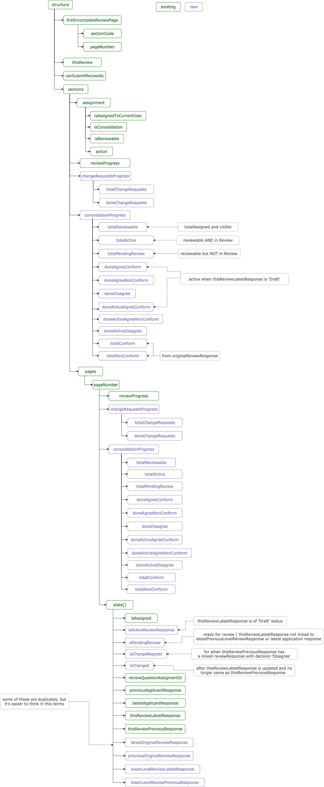
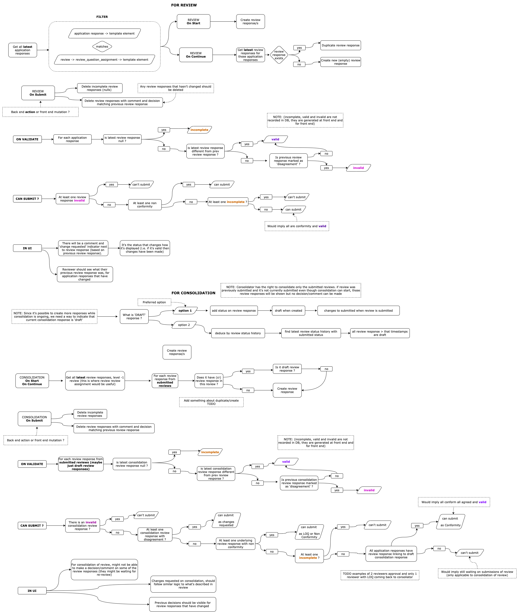

# Level 1+ Reviews and Changes Requested

The [Level 1 Reviews](Level-1-Review-And-LOQ.md) page explains how reviews with only one level work, which is a subset of how a review with more levels (per stage) should work.

The aim of this page is to outline the structure changes and flows:

## Consolidation in agreement

- Reviewer (Level 1) - reviewing an application
- Reviewer (Level 1) - submitting `Conform` or `Non Conform` advise higher level reviewer
- Reviewer (Level 2) - reviewing the lower level review and `agree` with all advised decisions
- Reviewer (Level 2) - submitting a review decision - if user has `is_last_level` will send back to Applicant when `LOQ (List of Questions)` or change outcome and stage when submitting `Non Conform` or `Conform`. If consolidation not `is_last_level` submission of review goes to upper level reviewer (e.g. Level 3) and the same process repeats for Level 2 and Level 3 reveiwers.

## Consolidation in disagreement (Changes-requested)

- Reviewer (Level 1) - reviewing an application
- Reviewer (Level 1) - submitting `Conform` or `Non Conform` advise higher level reviewer
- Reviewer (Level 2) - consolidatting lower level review(s) and `disagree` with some advised decisions
- Reviewer (Level 2) - submitting `Changes Requested` back to reviewer (e.g. Level 1)
- Reviewer (Level 1) - makes changes in response to `Changes Requested` and re-submit to upper level reviewer.

### Structure changes

#### Consolidation

- There is just one specific progress-bar on consolidation which considers only (one or many) lower level reviews agreement/disagreements (`consolidationProgress`).
- On the consolidation, each element `state` has:
  - the decision done in this current **consolidation** in `thisReviewLatestResponse`
  - the decision done in a previous **consolidation** (if any) in `thisReviewPreviousResponse` to track changes between this and a previous consolidation (of the same user)
- On the consolidation, each element `state` it can only have one lower level review:
  - the `lowerLevelReviewlatestResponse` is the latest decision submitted (or unchanged) from a lower level review
  - and `lowerLevelReviewPreviousResponse` to track changes between the latest submitted review and this one (after changes-requested to lower level reviewer)
- **TODO**: Not really sure exact the current use of `latestOriginalReviewResponse` and `previousOriginalReviewResponse` so will wait for feedback to complete this one....

#### Review

- The progress for a first-review (if no changes-requested) is done only with (`reviewProgress`)
- If some changes requested:
  - used both `reviewProgress` and `changeRequestsProgress` to track review progress
  - each element `state` has `isChangeRequest` and `isChanged` (if one of the change-requested) to track if changes are done
- On the review, similarly to consolidation each element `state` has:
  - the decision done in this current **review** in `thisReviewLatestResponse`
  - the decision done in a previous **review** (if any) in `thisReviewPreviousResponse` to track changes between this and a previous review (of the same user)
- To find the consolidator change-requested to this reviewer:
  - if it is stored inside `thisReviewPreviousResponse` (when review is in DRAFT) or `thisReviewLatestResponse` (if review in CHANGES_REQUESTED hasn't started)

## Submitting back to Applicant

When an upper level reviewer disagrees with some decision on a lower level it needs to be changed by the lower level reviewer on a new review.

The consolidation **needs to happen again and be in agreement** so it can be sent to Applicant (with Reviewer Level 1 comments) in the form of `LOQ (List of Questions)`.

Currently we don't allow submitting directly to Applicant when there is a disagreement.

### Back End workflow

- The following changes are done through work of [Actions plugins](https://github.com/openmsupply/conforma-server/wiki/Triggers-and-Actions).

* After `assignment` or `self-assignment` happens (more details about this in [Assignment Process](Assignment-Process.md))
* On review level 1 **start**:
  - creates new `review` with status `DRAFT`
  - create `review_response` with status `DRAFT` for each `review_question_assignment` associated to `application_response`
  - in the list of applications the action `CONTINUE_REVIEW` is available for this user now
* On review level 1 **submission**:
  - trim `review_responses` that have been created but not reviewed by user
  - update remaining `review_response` status to `SUBMITTED`
  - update `review` status to `SUBMITTED`
  - create new `review_assignment` for each user that can do reviewer level 2
  - in the list of applications the action `VIEW_REVIEW` is available for this user now (review is not editable)
* On review level 2 **self-assign**:
  - update `review_assignment` status `ASSIGNED`
  - create `review_question_assignment` to each `review_response` that have latest status as `SUBMITTED` (to get only from submitted reviews)
  - in the list of applications the action `START_REVIEW` is available for this user
* On review level 2 **start**:
  - creates new `review` with status as `DRAFT`
  - create `review_response` with status `DRAFT` for each `review_question_assignment` associated to `review_response`
  - in the list of applications the action `CONTINUE_REVIEW` is available for this user now
* On review level 2 **submission**:
  - trim `review_response` that have been created but not reviewed by user
  - update other `review_response` status to `SUBMITTED`
  - update `review` status to `SUBMITTED`
  - update reviews with associated `review_response` (by `review_response_link_id`) that have decision of `disagree` by level 2 reviewer with status to `CHANGES_REQUESTED`
  - in the list of applications the action `VIEW_REVIEW` is available for this user now (review is not editable)
  - in the list of applications the action `UPDATE_REVIEW` is available for users owner of the Review with status `CHANGES_REQUESTED`
* On review level 1 **update**:
  - creates new `review` with status as `DRAFT`
  - create `review_response` with status `DRAFT` duplicating lastest `review_response` with status `SUBMITTED` from this user
  - in the list of applications the action `CONTINUE_REVIEW` is available for this user now
* On review level 1 **submission**:
  - trim `review_responses` that are duplicated and not changed
  - update `review` status to `SUBMITTED`
  - update other `review` of level 2 with `review_question_assignment` associated to `review_response` status to `PENDING`
  - in the list of applications the action `VIEW_REVIEW` is available for this user now (review is not editable)
  - in the list of applications the action `RESTART_REVIEW` is available for users owner of the Review with status `PENDING`

### Front End

- Fetches actions and calculates progress of review (from application) or review with changes requested
- GraphQL mutation to create review responses - linked to another review or to application response
- GraphQL mutation to update `review_response` and `review_decison`
- Validates submission of review and give options to submmit based on `is_last_level` and if review is level 1+
- GraphQL mutation to request submission of review

Similart to what was in previous [Level 1 Reviews](Level-1-Review-And-LOQ.md), but considering review of review.

## Validation of Submission

### Review

First review validation in more details on [Level 1 Review and LOQ](Level-1-Review-And-LOQ.md).

When **review** is updated as a result of `Changes Requested` by a Level 1+ reviewer, it can only be submitted if general validation passes AND all questions with change requests have been changed.

Logic to check validation of a **changes-requested review** is:

- `thisReviewLastestResponse` is different to `thisReviewPreviousResponse` that has some associated `reviewResponse.reviewResponseLinkId` with decision of `disagree`. This is more easily validated with fields `isChangeRequest` and `isChanged` in the 'state' of each element.

### Consolidation

Logic to check validation is:

- On `disagreement` it will create a **changes-requested** decision and be submitted back to other reviewers
- If all `agreement` and every decision is `conform` then the decision can only be `Conform`, the application goes to the next stage - and Applicant would receive a message informing that (not implemented).
- If all `agreement` and some decision is `non-conform` then the decision can be either `LOQ` or and submitted back to Applicant for changes. Or decision is `Non-conform` which should change the outcome and Applicant would receive a message informing that (not implemented).

### Review validity

