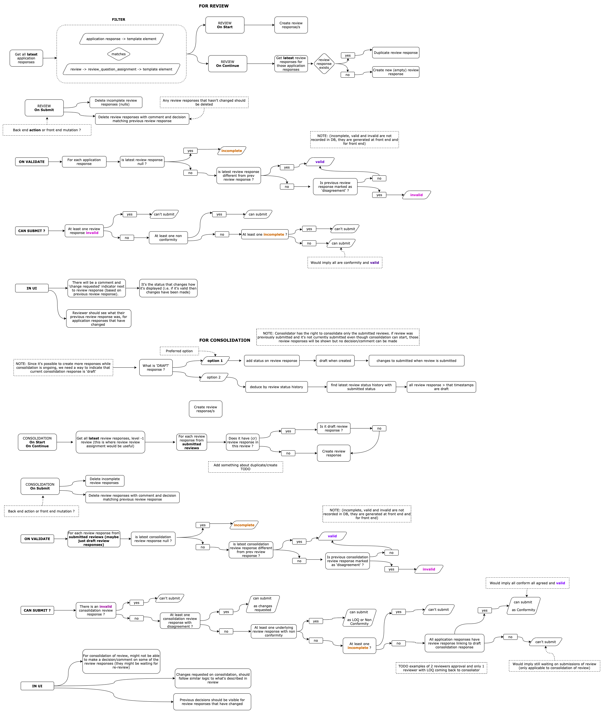

# Level 1 Review and LOQ

The aim of this page is to outline the structure and flow of:

- Reviewer - reviewing an application
- Reviewer - submitting LOQ (List of Questions)
- Applicant - making changes in response to LOQ
- Applicant - re-submitting application with changes
- Reviewer - re-reviewing changes that were made

In the context of this document, we are assuming that reviewer is already assigned, all sections and they are the only level reviewer defined for a given stage.

## Brief Summary

Below is the summary of logic aspects of this topic

### Back End

- Changes `review.status` and `application.status` to inform front end of actions that can be made
- On review **submission** trim `review_responses` that have been created but not reviewed by user
- On application **re-submission**, trim `application_response` that are duplicated and not changed
- On review **re-submission**, trim `review_responses` that are duplicated and not changed

### Front End

- Fetches actions and calculates progress of review and application
- GraphQL mutation to create review and application responses
- GraphQL mutation to update `application_response` or `review_response`
- Validates submission of review and application
- GraphQL mutation to request submission of review and application

### Structure

The 'state' of application and review (actions, progress, etc..) is calculated and stored in one state structure. It aids visual component and de-couples logic from UI elements. This structure is recalculated whenever a response is changed. Initial structure is constructed in `useGetApplicationStructure` and is used for applicant related UI, `useGetReviewStructureForSection` adds review related information, the later adds extra information the former. It's best described in the `Application-and-Review-Workflow.png` diagram.

## Schema

The aim of this diagram is to give some context (an anchor point), it's an abstracted schema diagram, not all of the tables involved in Review and LOQ process are shown

This schema structure allows new responses to be created (previous responses to be duplicated) whenever a review or application are opened (restarted) for editing, and this creates a system which maintains historic data integrity.

## Starting and Re-Staring Review

**Front End**

When reviewer start/re-starts a review, new `review_response` entities are created for every `latest` `application_response`.
If latest `application_response` already has a `review_response` linked (from previous review), `review_response` is duplicated, which is stored in the `review_response_linked_id` field. Done by `useRestartReview` and `useCreateReview` hooks.

`latest_application_response` is just application response with latest `time_updated` for a given element.

It's possible that latest application response is not visible (it could become invisible due to changes in application), these are ignored.

We only create `review_response` for elements that are assigned to reviewer via `review_question_assignment` (see [Assignment Process](Assignment-Process.md) for more details)

When submitting the review each `review_response` modifyed will be set as `is_latest_review_submission` as TRUE. This helps in actions generating LOQ using GraphQL queries.

**Back End**

- There is a Trigger that runs on insert of `review_response` to set previous `review_response` (with the same `review` and `template_elment`) to have the fields `is_latest_review_submission` set to FALSE.
- When review is submitted, an action will `trim` any responses that haven't changed and will update latest review responses `time_updated` to match review submission time (latest from status and stage history table) `trimResponses` action.

**Review Status**

We will be restricting editing of review tables (apart from `trigger`) via postgres row level policies. Front end requests status change by setting `trigger` on review table to `onReviewCreate`, `onReviewSubmit`, `onReviewRestart`, and back end changes this via `changeStatus` action. Front end needs to wait for `trigger` to reset to `null` before displaying new state of review

## Re-Staring Application

In response to LOQ, an applicant can restart an application. Similar logic to the one described in above section applies.

## Review Decision

Is created for each iteration of a review, can be of `status`:

- `LIST_OF_QUESTIONS`
- `CONFORM`
- `NON_CONFORM`
- `CHANGES_REQUESTED` - To be explained in [Level 1+ Reviews](Level-1+-Reviews-and-Changes-Requested.md)
- Default: `NO_DECISION`

See `Validation of Submission` below for choices that will be available to the user.

## Review Responses Visibility

`is_visible_to_applicant` field (not editable by any user, only by back end) controls visibility of `review_response` from applicant perspective. And `recommended_applicant_visibility` field (which is editable by reviewer) suggests visibility of review_response to applicant. `updateReviewVisibility` back end action will set `is_visible_to_applicant` when review is submitted. See `LOQ Workflow Diagram` below

## Actions

Front end determines user actions based on review and application status. And theses statuses are changed by back end via actions, here is an abstracted diagram:

Actions for review are computed by section via `useGetReviewStructureForSections` -> `generateReviewStructure` -> `generateReviewSectionActions`

Actions for applications `changeRequestsProgress` and `isChangeRequest` is used to display actions in Application Home pages, those are generated in `useGetApplicationStructure` -> `addApplicantChangeRequestStatusToElement` and `generateApplicantChangesRequestedProgress`.

See `Structure` below for more details

## Validation of Submission

When **application** is restarted as a result of LOQ, it can only be submitted if general validation passes AND all questions with change requests have been changed. Logic for this is:

`latestApplicationResponse` is different to `previousApplicationResponse` where `previousApplicationResponse` is linked to non confirm `reviewResponse`

**review** can be submitted as `LIST_OF_QUESTIONS` or `NON_CONFORM` when at least review_response is marked as `decline`. Otherwise can only be submitted as `CONFORM` if ALL assigned visible latest application responses have `approve` status review responses.

One thing to note, since we always look at latest application response and it's linked review response, we guarantee that all new changes by applicant will be re-reviewed.

## Structure

Application and Review Structure are generated in hooks `useGetApplicationStructure` and `useGetReviewStructureForSection` respectively, these structures are re-computed whenever responses are changed. In the context of Review and LOQ, these fields are added:

### Application

### Review

## Components and Hooks

This is described in Application and Review Flow documentation [Application And Review Flow](Spplication-And-Review-Flow.md)

# LOQ Workflow Diagram

# Responses Workflow Diagram

Note this diagram may be slightly outdated, but it is still indicative of implemented logic. It also goes beyond Review and LOQ topic

