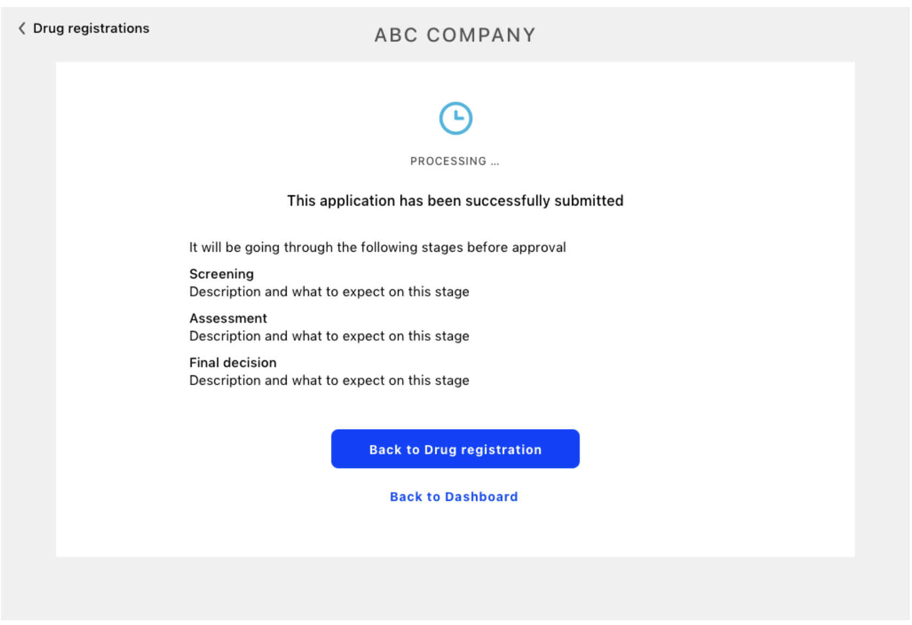

_This should give us a guide of what UI mockups we need to demonstrate, as well as inform the details of the Navigation links menu._

## `/login`

### Login Page

When trying to access any URL, if not already authenticated, user is redirected to this page.

Example: [https://balsamiq.cloud/scs7giw/ponj59g/r2278](https://balsamiq.cloud/scs7giw/ponj59g/r2278)

(Note: requested URL is remembered, so that after successful login, user is redirected straight to that page)

---

## `/`

### Home (Dashboard)

“Welcome” page showing a summary of activities in progress, e.g. incomplete applications, incomplete reviews, new notifications, etc.

#### Applicant

Example: [https://balsamiq.cloud/scs7giw/ponj59g/r53EF](https://balsamiq.cloud/scs7giw/ponj59g/r53EF)

#### Reviewer

Example: [https://balsamiq.cloud/scs7giw/ponj59g/r4BD1](https://balsamiq.cloud/scs7giw/ponj59g/r4BD1)

---

## `/applications`

### Application list

A list/table of all existing applications that the user is allowed to see.

Clicking on an Application (a line in the list) takes you to the **Home** page for that application.

The URL would update with a query string according to the filter/sorting, so that any filter/sorting combination can be saved as a link/bookmark.

E.g. `/applications?assigned=none&status=in-progress&priority>10`[Note 1](#note1)

Bookmark example: [https://balsamiq.cloud/scs7giw/ponj59g/rB39F](https://balsamiq.cloud/scs7giw/ponj59g/rB39F)

#### Applicant

Sees all applications they’ve applied for, or maybe others belonging to their organisation. With Columns showing to the applicant: Application number, name, stage,status, outcome and "days since last action". Desirable to see the messages for each application here. Examples:

1. Filtered by application type: [https://balsamiq.cloud/scs7giw/ponj59g/rDA7E](https://balsamiq.cloud/scs7giw/ponj59g/rDA7E)
2. Using other filters: [https://balsamiq.cloud/scs7giw/ponj59g/r08EE](https://balsamiq.cloud/scs7giw/ponj59g/r08EE)

#### Reviewer

Sees all applications assigned to them. With columns showing to the reviewer (restricted according to permissions): Application number, Name, Company, Date received, Date updated, Assigned (per section), Priority, Stage, Review status, outcome.

Example: [https://balsamiq.cloud/scs7giw/ponj59g/r3901](https://balsamiq.cloud/scs7giw/ponj59g/r3901)

#### Supervisor & Consolidator

Sees un-assigned applications (Supervisor) or applications that have been reviewed and are ready for consolidation or chief evaluation before being sent back to the Applicant.

Example: [https://balsamiq.cloud/scs7giw/ponj59g/r4C62](https://balsamiq.cloud/scs7giw/ponj59g/r4C62)

---

## `/application/new`

### New application launcher

A standard page for creating a new application.

This page can support query string to specify the application type (or application category) that shows selected in the dropdown menu.

E.g. `/application/new?type=drug-registration`

On clicking the “Start application” button of this form, a new “application” record is created in the database. And the page for in-progress application is loaded.

#### Applicant

Can choose from a list of categories (if it is configured to be used) or application's types that they’ve been given permission to apply for. And click "Start application" to apply for.

Example: [https://balsamiq.cloud/scs7giw/ponj59g/r1D2B](https://balsamiq.cloud/scs7giw/ponj59g/r1D2B)

---

## `/application/[serialNum]/[sectionName]/page[page]`

### In-progress Application

Shows a specific page of an application that has been created (or while editing or reviewing). URL is the same regardless of whether user is Applicant or Reviewer.

On clicking the "Next" button it takes to another page in the same section or the next section Reviewer can see only their sections, or it goes to the **Summary** page after the last page.

#### Applicant

Can see all pages (from all sections) with the form content to be filled. The fields are editable until the application is submitted (on the summary page). When the application has "Changes required", the user can only edit/add content of specific fields.

Example:

1. Create application: [https://balsamiq.cloud/scs7giw/ponj59g/rE318](https://balsamiq.cloud/scs7giw/ponj59g/rE318)
2. Changes required in application: [https://balsamiq.cloud/scs7giw/ponj59g/r586F](https://balsamiq.cloud/scs7giw/ponj59g/r586F)

#### Reviewer

Can see one (or more) sections of an application, accordingly with what is assigned to them. In a page each question is not editable, but have a box with the options to add or edit a comment and make a decision.

Example: [https://balsamiq.cloud/scs7giw/ponj59g/r1FFB](https://balsamiq.cloud/scs7giw/ponj59g/r1FFB)

---

## `/application/[serialNum]/summary`

### Application summary page

The final page of an application, where the applicant/reviewer can see all the sections and questions, check all the work in one place with the submit button.

Clicking in one section on the Progress box (right-hand side) takes back to the in-progress section page where the responses/comments can be edited.

### Applicant

See the complete list of all questions (in drop-down sections) with their responses.

Example: [https://balsamiq.cloud/scs7giw/ponj59g/rD624](https://balsamiq.cloud/scs7giw/ponj59g/rD624)

### Reviewer

~~Sees the list of responses in the sections they are assigned to. The decision and the comment next to each question, and the overall status per section. The comment per section can be edited in here, maybe the comment per question too.~~

Example: [https://balsamiq.cloud/scs7giw/ponj59g/r189E](https://balsamiq.cloud/scs7giw/ponj59g/r189E)

---

## `/application/[serialNum]/submission`

### Application submission page

End page to be displayed after the application is submitted. Each template can have a specific `submissionMessage` defined that is displayed here.
When the application hasn't been submitted (on status = Draft | Withdrawn | Changes requested) this page should redirect to either the summary or the last invalid page.

Example: 

---

## `/application/[serialNum]`

### Application home page

The “home page” of a specific application.

Any links to existing applications would usually point to here. Shows an overview of the application, with additional options for Reviewers or Supervisor (e.g. “Assign”, or “Consolidate”) and the special option for the Director when in the final stage to "Proceed to Final Approval".

#### Applicant

Example:

1. After submitted: [https://balsamiq.cloud/scs7giw/ponj59g/rD9E0](https://balsamiq.cloud/scs7giw/ponj59g/rD9E0)
2. Changes required: [https://balsamiq.cloud/scs7giw/ponj59g/r4FF5](https://balsamiq.cloud/scs7giw/ponj59g/r4FF5)
3. After re-submitted: [https://balsamiq.cloud/scs7giw/ponj59g/r564B](https://balsamiq.cloud/scs7giw/ponj59g/r564B)

#### Reviewer

Example: [https://balsamiq.cloud/scs7giw/ponj59g/r54B5](https://balsamiq.cloud/scs7giw/ponj59g/r54B5)

#### Supervisor & Consolidator

Examples:

1. Before reviews: [https://balsamiq.cloud/scs7giw/ponj59g/r945D](https://balsamiq.cloud/scs7giw/ponj59g/r945D)
2. After reviews: [https://balsamiq.cloud/scs7giw/ponj59g/r9840](https://balsamiq.cloud/scs7giw/ponj59g/r9840)

#### Director

Example: [https://balsamiq.cloud/scs7giw/ponj59g/rD5AC](https://balsamiq.cloud/scs7giw/ponj59g/rD5AC)

---

## `/application/[serialNum]/review`

Overview/Start page for reviews of application and reviews of reviews (consolidation). User will see different content depending on review assignments and their respective review. For Reviewers who have assigned content to review, they will have the option to "Start" review, which will create a Review in the database and re-direct to the specific review page. For existing reviews with pending status, slightly different UI will be presented and instead of "Start", "Continue" button will be shown.

This page will have mutations to `create review`, `self-assign review assignment`, `create review responses`. Logic for these is best described in diagrams, `Response Flow` and `Review and Consolidation URL Flow` ![Diagrams Back End Repo Wiki]https://github.com/openmsupply/conforma-server/wiki/Database-Schema-Review-And-Consolidation#diagram)

## `/application/[serialNum]/review/[reviewId]`

Specific Review or Consolidation page. Assigned Reviewer(s) can mark questions as "Conform"/"Non-conform" or "Agree"/"Disagree" for consolidation and add comments. Review Decision can also be made 

This diagram is also useful for this URL `Review and Consolidation URL Flow` 

---

## `/application/[serialNum]/assignment`

_Assigment URLs to be decided_

### Application assignment mode

The “home page” of a specific application during assignment of reviewers.

The Supervisor -- with the proper permission to assign reviewers -- can do the assignment of reviewers to one (or more) section when the application is submitted to a new stage (the assignment changes per stage). After assigned the reviewers can review the specific sections.

Example: [https://balsamiq.cloud/scs7giw/ponj59g/r3DC3](https://balsamiq.cloud/scs7giw/ponj59g/r3DC3)

---

## `/application/[serialNum]/approval`

### Application approval page

The final page that only the Director sees where they can apply the final approval or rejection of an application.

Example: [https://balsamiq.cloud/scs7giw/ponj59g/rA5E5](https://balsamiq.cloud/scs7giw/ponj59g/rA5E5) (navigated to from Overview page)

---

## `/admin`

### Admin home page

Overview of Admin activity (New users, recently reviewed applications, etc.)

---

## `/admin/templates`

### Application Template list

Basically the same kind of thing as the Application list, but for templates

---

## `/admin/templates/new`

### New Template launcher

Initial template creation start page, where user enters basic unique info (Name, code, etc). Once this page is submitted, a new Template record is created in the database.

Example: [https://balsamiq.cloud/scs7giw/ponj59g/r3C4F](https://balsamiq.cloud/scs7giw/ponj59g/r3C4F)

---

## `/admin/templates/[id]/[step]`

### Template in-progress creation/editor

The **step** refers to the general area of Template creation, e.g. Permissions, Sections, Stages, Triggers, etc. This is not precisely defined yet, so this url will be refined when we have a clearer grasp of the Template Builder UI.

Examples:

- [https://balsamiq.cloud/scs7giw/ponj59g/r4F8C](https://balsamiq.cloud/scs7giw/ponj59g/r4F8C) (Form element)

- [https://balsamiq.cloud/scs7giw/ponj59g/rA795/b4316](https://balsamiq.cloud/scs7giw/ponj59g/rA795/b4316) (Permissions)

- [https://balsamiq.cloud/scs7giw/ponj59g/r1F61](https://balsamiq.cloud/scs7giw/ponj59g/r1F61) (Permissions new)

- [https://balsamiq.cloud/scs7giw/ponj59g/r207F](https://balsamiq.cloud/scs7giw/ponj59g/r207F) (Section logic)

- [https://balsamiq.cloud/scs7giw/ponj59g/r8DF6](https://balsamiq.cloud/scs7giw/ponj59g/r8DF6) (Another form object)

- [https://balsamiq.cloud/scs7giw/ponj59g/r5C25](https://balsamiq.cloud/scs7giw/ponj59g/r5C25) (Form object)

- [https://balsamiq.cloud/scs7giw/ponj59g/r9376](https://balsamiq.cloud/scs7giw/ponj59g/r9376) (Stages)

- [https://balsamiq.cloud/scs7giw/ponj59g/r6694](https://balsamiq.cloud/scs7giw/ponj59g/r6694) (Triggers)

---

## `/admin/users`

### User management

Design to be determined, but eventually would want to be able to:

- Delete Users
- Assign Users to Roles (if we’re having roles)
- Assign or revoke Permissions to/from Users or Roles

---

## `/admin/permissions`

### Permissions management

Overview of permissions, with ability to add, delete, (merge?) etc.

---

## `/admin/config`

### Configuration

Global settings and configuration for whole app, such as logo, name, preferences & localisations.

---

## `/account`

### User account management

Any user can do basic account tasks, such as update their contact details, change password, etc.

---

## `/organisations/[name-of-org]`

### Organisation overview

Overview of organisation information, including a list of all members. Also includes a summary of applications that have been applied/granted and pending/previous, each which link to their respective Product or Application page. With appropriate permissions (e.g. Owner), can click “Edit” buttons to change or update details and members

Example: [https://balsamiq.cloud/scs7giw/ponj59g/r650F](https://balsamiq.cloud/scs7giw/ponj59g/r650F)

---

## `/organisations/[name-of-org]/members`

### Organisation Member edit

Owner (or someone with appropriate permissions) can delete members from organisation, or change their “level” (e.g. Admin/Owner)

Example: [https://balsamiq.cloud/scs7giw/ponj59g/r96DA](https://balsamiq.cloud/scs7giw/ponj59g/r96DA)

---

## `/notifications`

### Notification centre

A list (basically an Inbox) of all notifications, with some limited filters (Unread/Read etc.). Similar to Github notification inbox.

URL also updates with query string, so (for example) links elsewhere can link to the Inbox for everything associated with a specific application:

E.g. `/notifications?serialNum=123454678`

Example: [https://balsamiq.cloud/scs7giw/ponj59g/rEFAE](https://balsamiq.cloud/scs7giw/ponj59g/rEFAE)

## `/notifications/[notificationId]`

### Notification page

A specific notification message, such as an Approval notice, or Re-submission request (for applicants) or New Application alert (for Reviewers/Supervisors). Most of these would be duplicated in Email (or via another “Action”).

Example: [https://balsamiq.cloud/scs7giw/ponj59g/r9F6E](https://balsamiq.cloud/scs7giw/ponj59g/r9F6E)

---

## `/products`

### Products page

An overview of all the products that have been registered by the system. Presented in tabular form (like applications), showing relevant info such as date, expiry, etc. with appropriate filters.

Access to page controlled by permissions structure.

Would utilise Permissions to determine who is allowed to see what.

Example: [https://balsamiq.cloud/scs7giw/ponj59g/r6C38](https://balsamiq.cloud/scs7giw/ponj59g/r6C38)

---

## `/products/[productId]`

### Individual product page

Shows detailed information for a specific product, with links and contact information for the associated organisations and individuals.

Example: [https://balsamiq.cloud/scs7giw/ponj59g/rBFCD](https://balsamiq.cloud/scs7giw/ponj59g/rBFCD)

---

### Footnotes

<a name="note1">[Note 1](#n1root)</a>: The use of `>` in the query string is not really going to work unless we write our own parser. Probably best to just define fields such as `priorityGreaterThan=10`.
