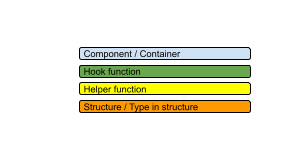
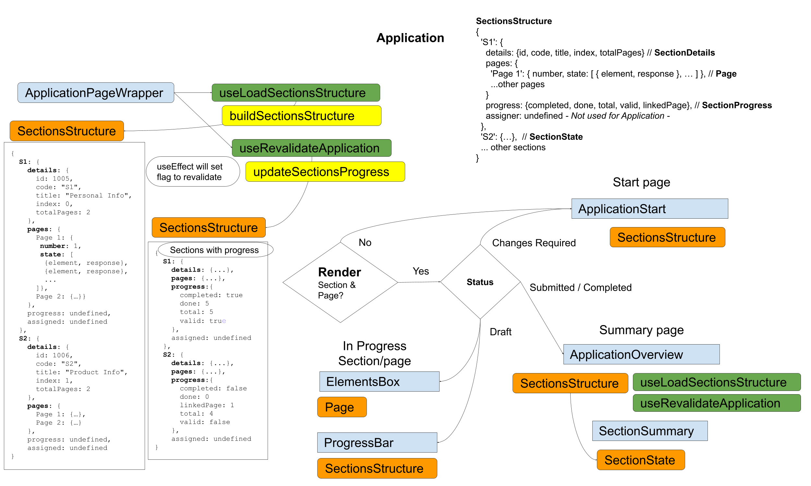
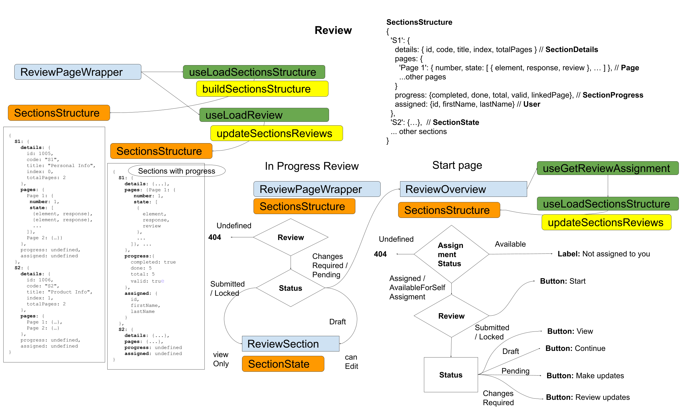

_This should help Front-end developers understand the base UI display structure used in Application and Review pages._

A few hooks are used to build and update the sections structure. This structure is an object with keys as each section `code` and storing everything related to the section on a `SectionState` object. This object contain the properties: `details`, `pages`, `progress` and `assigned` (only used in reviews). In the `pages` object each page `name` has all the `PageState` object which contains all elements (and corresponding response and review) in each page.

## List of hooks

- `useLoadSectionsStructure` - responsible for creating the structure (without `progress` or `assigned` properties)
- `useRevalidateApplication` - receives `sectionsStructure` and uses helper `updateSectionsProgress` to set `progress` in each section
- `useLoadReview` - Call `useLoadSectionsStructure` and uses helper `updateSectionsReviews` to set reviews in the structure

## Flow diagrams

### Application

### Review

