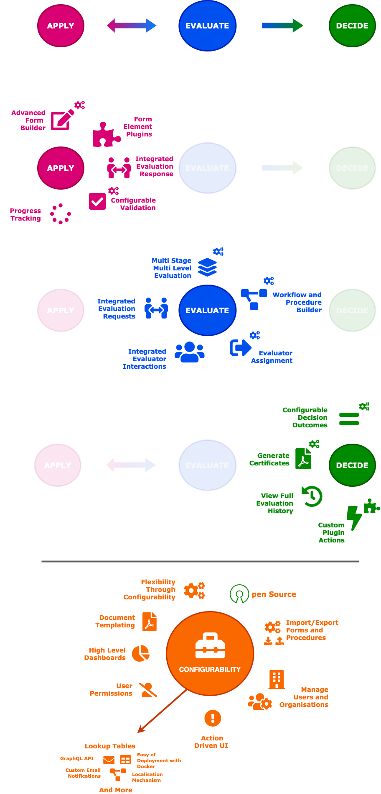

+++
title = "Introduction"
insert_anchor_links = "right"
weight = 1
+++

## What is mFlow?

Content here.

### What can mFlow do?

Content here.

### Can you put that in diagrams?

### Subheading 3

Content here.

### Subheading 4

Content here.
