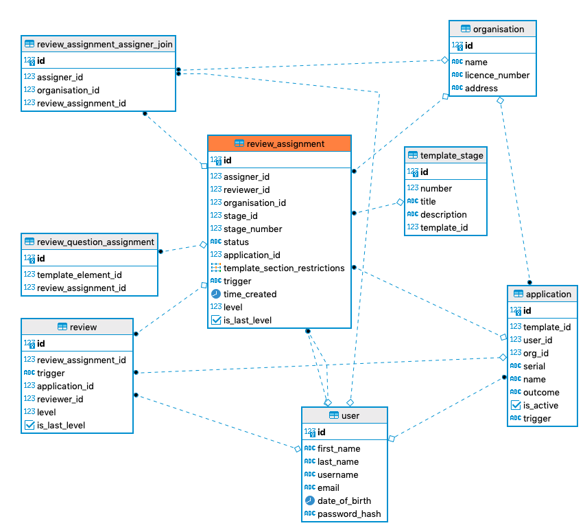
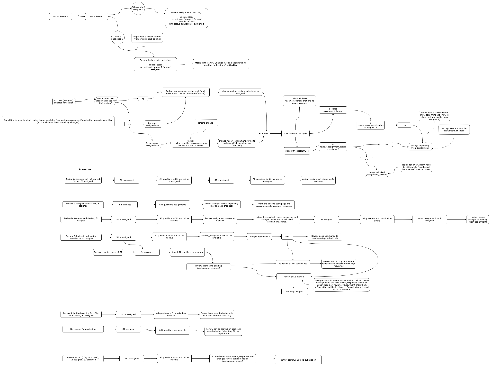
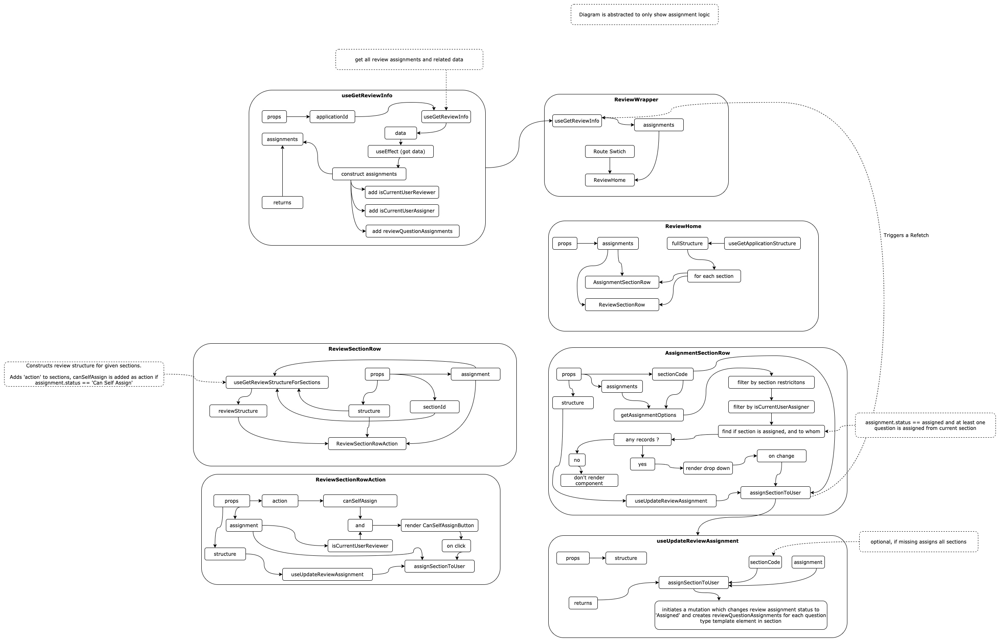

# Assignment Process

The logic of assigning a review spans between both web app and server — front end is only concerned with queries and mutations to review_assignment and review_question_assignment tables, whereas back end does most of the grunt work (through actions and triggers) and generates records in those tables based on user permissions and states of application and its review.

## Schema

Seems like a good starting (anchor) point for describing this functionality, let's have look:

First of all, some bulletpoint (and rules) to help clarify the diagram

### Assignment rules

- One `review_assignment` should exist per reviewer/application/stage/level
- Review assignment should only be editable by a reviewer if it's `Available for self-assignment`, otherwise by linked `Assigner`. Review assignment should not be editable once stage of review assignment is different to the current application stage.
- `is_last_level` field is a helper field for front end (to avoid front ending needing to figure if if review is last level for given stage)

### Assignment status

Review assignment can have the following statuses

- `Available` -> Can be assigned by assigner
- `Self-assigned by another` -> Was available for self assignment (but self assigned by someone else)
- `Assigned` -> indicates that the reviewer is able to create a review (or one already exists)
  - At least one `review_question_assignment` was linked to review_assignment
- `Available for self-assignment` -> Can be self assigned

### Restrictions

Review assignments can be restricted by section/s

- `template_section_restriction` is an array of section codes user can review
- Default is `null` which allow review of all sections or all questions in the application

### Assigner settings

- Review assignments of status `Available` or `Assigned` can be assigned by an assigner
- Assigner is linked through the `review_assignment_assigner_join` table

#### Difference between self-assignment and assignment

The idea behind self assignment originated with requirement for users (who are not themselves assigners) to be able to 'choose' or pick which application they will be reviewing.

**Note**: Currently self assignment is not restricted by `template_section_restrictions`.

## Pre-assignment process

To reduce front-end logic, server is responsible for generating `review_assignment` records, based on user permissions. This is done by an action called `generateReviewAssignments` which is configured to fire when application or review changes status.
e.g.: Application is Submitted, Review is approved and moves to new Stage or Level.

### Application submission

The server logic looks at all of the permissions linked to application template of type `review`, where template permission configurations match current `level` and `stage`. It creates `review_assignment` records for users who are linked to that template permission (through permission name), and any extra configurations (`template_section_restrictions`, `canSelfAssign`, etc..) are populated for new review_assignment record.

### Review submission

The server logic does similar thing as what is done when Application is submitted, but for level + 1. Typical scenario is a consolidator being informed that they can self assign a consolidation when lower level reviewer submits a review.

## Assigning process

Available for either a Reviewer that can do **self-assignment** or an Assigner with permission to **assign** applications of a certain template type on a `level` and `stage` (settings defined on the `template_permission` of each Template).

To **assign** or **self-assignment** the Reviewer of sections of one application there are option available on the Applications list of on the Application home page.

### Web App

#### Self-assignment

A GraphQL mutation is created the front-end when the user clicks on the **Self-assign** for one section.
What happens as a result of this mutation is:

1. `review_assignment.trigger` is set to ON_REVIEW_SELF_ASSIGN.
2. Changes `review_assignment.status` to **Assigned**.
3. Sets assigner of review assignment to current user
4. Adds `review_question_assignment` (for each question of ALL sections) to `review_assignment`
5. Other updates done on the server-side:

- Update other `review_assignment.status` from **Available for self-assignment** to **Self-assigned by another**

#### Normal assigning

A GraphQL mutation is created on the front-end when the user selects a reviewer in drop down for a section.

1. `review_assignment.trigger` is set to ON_REVIEW_ASSIGN.
2. Changes status of `review_assignment` to **Assigned**.
3. Sets assigner of current review to current user
4. Adds `review_question_assignment` (for each question on the section assigned) to `review_assignment`

## Diagram

This diagram is somewhat complex — it describes some functionality that is not implemented (re-assignment), but it can be helpful when visualising full assignment flow (and for analysing different scenarios of assignment)

## Re-Assignment

todo

# Front End Implementation

Best described in a diagram (this diagram is abstracted to only show bits related to assignments)

