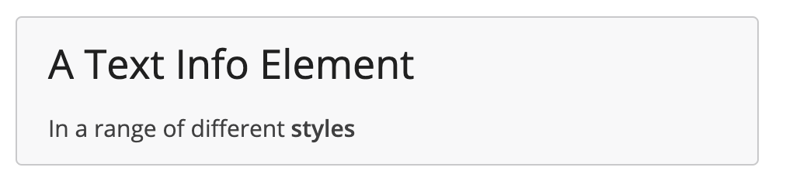
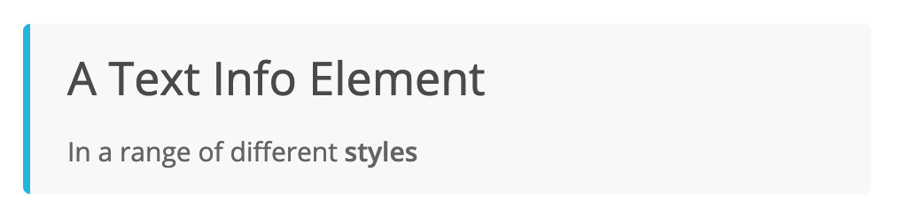
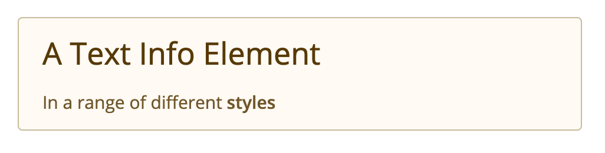
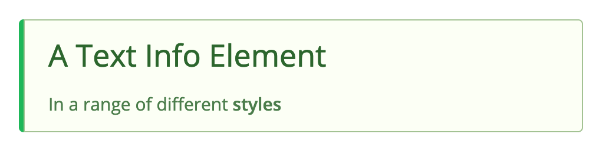
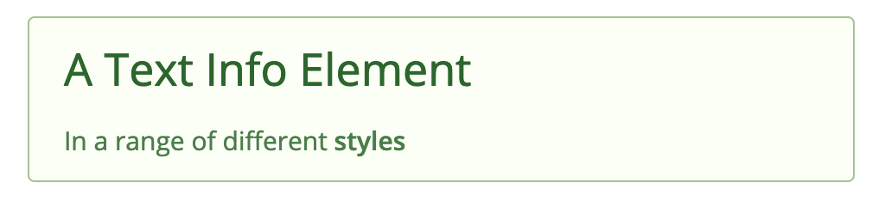
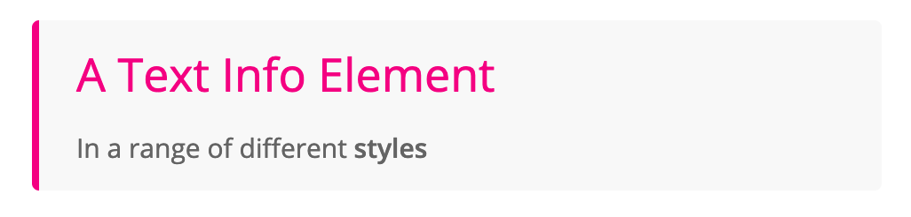
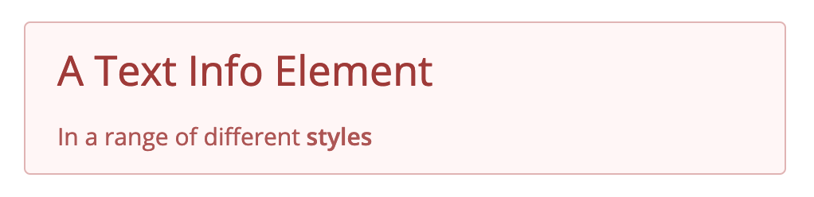
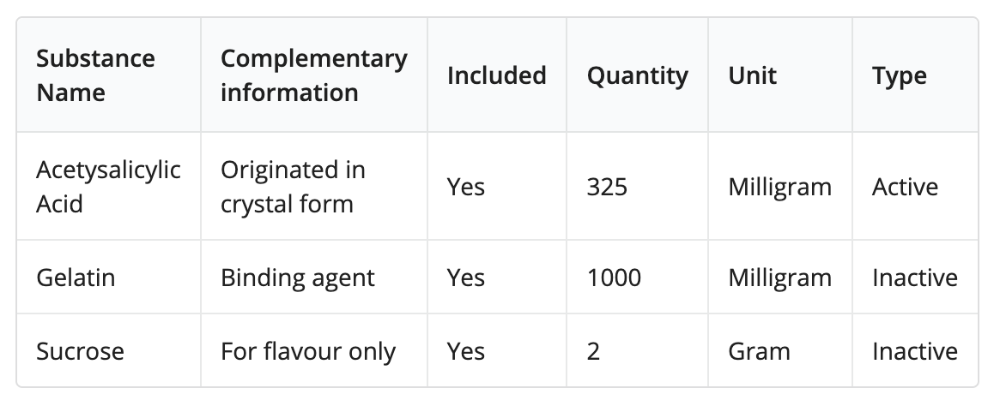

_Ongoing authoritative reference of Template Question/Element types, including input parameters and response type (shape). Please ensure this document matches the current implementation at all times._

## Contents

- [Template Element fields](#element-fields)
- [Question/Element types](#types)
  - [Short Text Input](#short-text)
  - [Long Text (Multi-line) Input](#long-text)
  - [Password](#password)
  - [Text Information](#text)
  - [Image Display](#image)
  - [Drop-down Selector](#dropdown)
  - [Radio Buttons](#radio)
  - [Checkboxes](#checkbox)
  - [File Upload](#file)
  - [List Builder](#list-builder)
  - [Page Break](#page)

<a name="element-fields"/>

## Template Element fields

These fields are common to all element types and have their own field in the `template_element` table.

- **id, section_id** : database references
- **code**: `string` -- unique (per template) identifier
- **index**: `integer` -- element ordering sequence (starting at `0`)
- **title**: `string` -- describes the element, shown in template builder (probably)
- **category**: `enum` -- either "Information" or "Question"
- **visibility_condition**: `JSON` -- dynamic query determining whether element appears to the user
  - default: `{"value": true}` (i.e. it always appears)
- **element_type_plugin_code**: `string` -- code of the question/element plugin that presents this element to the UI
- **is_required**: `JSON` -- dynamic query determining whether question is required to be answered
  - default: `{"value": true}`
- **is_editable**: `JSON` -- dynamic query determining whether can be edited (Would only be false in rare circumstances)
  - default: `{"value": true}`
- **validation**: `JSON` -- a dynamic expression for checking if the user's response is a valid input.
  - default: `{"value": true}` or just `true`
- **validation_message**: `string` -- the message that shows in the UI when validation fails.  
  _TO-DO: Handle multiple validation criteria with different messages (eg. "Not a valid email", "Email is not unique")_
- **parameters**: `JSON` -- the parameters specific to each question/element type. See individual plugins below for parameter breakdown
  <a name="types"/>

## Question/Element types

**Note**: all parameter fields can also have a dynamic query object instead of a primitive. The [`evaluateExpression`](https://github.com/openmsupply/application-manager-server/wiki/Query-Syntax) function will return literal strings (or numbers, booleans) as is. The types described for the parameters below are the type that is expected to be _returned_ from a query expression.

**Note**: parameters marked with \* can be defined as dynamic expressions -- these are specified in the `pluginConfig.json` file of each plugin.
<a name="short-text"/>

### Short Text Input

- **type/code**: `shortText`
- **category**: `Question`

_Free-form, single-line text input element_

#### Input parameters (in the `parameters` JSON)

- **label\***: `string` -- Text that shows in the HTML "label" attribute of the form element (Markdown string, with dynamic expression evaluation)
- **description\***: `string` -- additional explanatory text (usually not required) [Optional]
- **placeholder**: `string`-- text to display before user input (HTML "placeholder" attribute) [Optional]
- **default**: `string` -- value to set as response before user enters anything. Note that this is different from `placeholder` -- `placeholder` is just temporary display text, wheras `default` is an actual response that will be saved if the user doesn't explicitly change it. In general a `default` for a text input would not be desired; it would usually only be useful for editing _existing_ data.[Optional]
- **maskedInput**: `boolean` -- if `true`, displays user input as masked (hidden) characters -- i.e. for passwords. [Optional]
- **maxLength**: `number` -- response must be no longer than this many characters. If the user tries to type more, the response will be truncated to the maximum length.  
   _Note_: if you want to show an error state for trying to exceed the maximum, you'll need to specify a validation expression with a REGEX operator, and the range will need to be one character less than the `maxLength`, so the error state is triggered. So to set limit of 100 characters, you'd set `maxLength` to 101 and use the following expression for "validation":
  ```
  {
  operator: "REGEX"
  children: [
    {
      operator: "objectProperties",
      children: [
        "responses.thisResponse"
      ]
    }
    "^[\\\\s\\\\S]{0,100}$"
  ]
  }
  ```

#### Response type

_This describes the expected object that will be stored in the `application_response` table `value` field from the user's response_  
`{ text: <string> }`

---

<a name="long-text"/>

### Long Text (Multi-line) Input

- **type/code**: `longText`
- **category**: `Question`

_Free-form, multi-line text input element_

#### Input parameters (in the `parameters` JSON)

- **label\***: `string` -- Text that shows in the HTML "label" attribute of the form element (Markdown string, with dynamic expression evaluation)
- **description\***: `string` -- additional explanatory text (usually not required) [Optional]
- **placeholder**: `string`-- text to display before user input (HTML "placeholder" attribute) [Optional]
- **default**: `string` -- value to set as response before user enters anything (see [Short Text](#short-text) above for more detail) [Optional]
- **lines**: `number` -- height of the TextArea input, in number of lines/rows (default: 5)
- **maxLength**: `number` -- response must be no longer than this many characters. If the user tries to type more, the response will be truncated to the maximum length. (See Note in ShortText above for how to integrate `maxLength` with validation.)

#### Response type

_This describes the expected object that will be stored in the `application_response` table `value` field from the user's response_  
`{ text: <string> }`

---

<a name="password"/>

### Password Input

- **type/code**: `password`
- **category**: `Question`

_Secure password input field, with enter-twice confirmation_

#### Input parameters (in the `parameters` JSON)

- **label**: `string` -- Text that shows in the HTML "label" attribute of the form element (Markdown string, with dynamic expression evaluation)
- **description**: `string` -- additional explanatory text (usually not required) [Optional]
- **placeholder**: `string`-- text to display before user input (HTML "placeholder" attribute) [Optional]
- **requireConfirmation** `boolean` -- if `true`, display a second input field for user to confirm their password (Default: `true`). The only time you would normally want to set this to `false` is when using a Password element to _check_ an existing password (by validating it against a `/login` endpoint, for example), such as in the UserEdit template.
- **confirmPlaceholder**: `string` -- text to display as placeholder in the password confirm input field [Default: `"Confirm password"`]
- **maskedInput**: `boolean` -- if `true`, displays user input as masked (hidden) characters -- i.e. for passwords. [Optional -- default `true`]
- **showPasswordToggle**: `boolean` -- if `true`, displays a checkbox to show the masked input as regular text [Optional -- default `true`]
- **validationInternal**: `JSON` -- a dynamic expression for checking if the user's response is a valid input. The validation method must be internal to the plugin (as opposed to the general "validation" field on all plugins) since the password is never exposed to the Wrapper, only the hash, so any checks on its validity must take place in the plugin's own validation method.
- **validationMessageInternal**: `string` -- the message that shows in the UI when validation fails. (For internal validation, as above)

Note that, as the password itself is never stored (only the hash), this fields input is reset if the page is reloaded.

#### Response type

_This describes the expected object that will be stored in the `application_response` table `value` field from the user's response_

```
{
  text: <string> (Only used to display '•••••••' on the summary page)
  hash: <string>
}
```

---

<a name="text"/>

### Text Information

- **type/code**: `textInfo`
- **category**: `Information`

_For displaying blocks of text in the application_

#### Input parameters

- **title\***: `string` -- Heading text to display [Optional]
- **text\***: `string` -- body text to display
- **style\***: `string` -- a range of present visual styles [Optional]. Options are: `none` (default), `basic`, `info`, `warning`, `success`, `positive`, `error`, `negative`  
  (see screenshots below)

**Note**: `title` and `text` strings support basic [**Markdown**](https://en.wikipedia.org/wiki/Markdown) formatting

#### Style options

#### `style: none` (default)


### `style: basic`



### `style: info`



### `style: warning`



### `style: success`



### `style: positive`



### `style: error`



### `style: negative`



---

<a name="image"/>

### Image Display

- **type/code**: `imageDisplay`
- **category**: `Information`

_For displaying images in applications_

#### Input parameters

- **label\***: `string` -- Label for image (above) [Optional]
- **description\***: `string` -- Detailed text [Optional]
- **url\***: `string` -- URL of the source image file
- **size\***: `string` -- From SemanticUI "size" parameter, one of the following values: `mini`, `tiny`, `small`, `medium`, `large`, `big`, `huge`, `massive` (default `medium`)
- **alignment\***: `string` -- one of `left`, `center`, `right` (default `left`)
- **altText\***: `string` -- text for the HTML `alt` and `title` attributes (will show as tool-tip) [Optional]

---

<a name="dropdown"/>

### Drop-down Selector

- **type/code**: `dropdownChoice`
- **category**: `Question`

_Multi-choice question, with one allowed option, displayed as Drop-down list (Combo-box)_

#### Input parameters

- **label\***: `string` -- as above
- **description\***: `string` -- as above [Optional]
- **options\***: `array[string | object]` -- array of options for the user to select from. If an array of **strings** is provided, these strings will be displayed to the user. However, if an array of **objects** is provided, you will also need to specify an `optionsDisplayProperty` (see below)
- **default**: `string`/`number` -- if not provided, defaults to index 0.
- **search**: `boolean` (default: `false`) -- if `true`, the list of options can be searched and filtered by user
- **optionsDisplayProperty**: If `options` (above) consists of an array of objects, this parameter specifies the field of each object to be displayed in the options list. For example, if `options` was a list of organisation objects (i.e. `{orgId, name, licenceNumber}`), you'd probably specify `name` as the `optionsDisplayProperty`. Note that even though one field is displayed to the user in the Dropdown list, the _entire_ selected object is saved as the selection. And if `optionsDisplayProperty` refers to a field that doesn't exist on the supplied object, the plugin will fail and show in error in the application.
- ~~**hasOther**: `boolean` -- if `true`, an additional text-entry field is provided so the user can add their own alternative option _(not yet implemented)_~~

#### Response type

```
{
  optionIndex: <integer> (index from the options array)
  text: <string> (actual text from options array)
  selection: <string | object> (entire object or string from the supplied options list)
}

```

---

<a name="radio"/>

### Radio Buttons

- **type/code**: `radioChoice`
- **category**: `Question`

_Multi-choice question, with one allowed selection, displayed as labelled radio buttons_

#### Input parameters

- **label\***: `string` -- as above
- **description\***: `string` -- as above [Optional]
- **options\***: `array[string | object]` -- as above (in [Drop-down](#dropdown))
- **default**: `string`/`number` -- the value initially selected before user input. If `number`, refers to the index of the options array. If not provided, no options will be pre-selected.
- **optionsDisplayProperty**: -- as above (in Drop-down)
- **hasOther**: `boolean` (default `false`) -- if `true`, displays an additional "Other" option with a free text field for inputting additional user-defined option.
- **otherPlaceholder**: `string` -- placeholder text to show in the text input if `hasOther` is enabled.

  **Note**: if including an "Other" options, then `options` should only be an array of strings, or else you'll be mixing objects with strings, which will cause problems. In other words, you should never have both `optionsDisplayProperty` and `hasOther` defined in the same question element.

#### Response type

```
{
  optionIndex: <integer> (index from the options array)
  text: <string> (actual text from options array)
  selection: <string | object> (entire object or string from the supplied options list)
  other: <boolean> (`true` if "Other" has been selected)
}

```

---

<a name="checkbox"/>

### Checkboxes

- **type/code**: `checkbox`
- **category**: `Question`

_One or more checkboxes, any number of which can be selected/toggled_

#### Input parameters

- **label\***: `string` -- as above
- **description\***: `string` -- as above [Optional]
- **checkboxes\***: `array[string | checkbox]` -- an array of labels, one per checkbox. For more complexity, an array of Checkbox objects can be provided with the following properties:

```

{
  label: <string> - text to display next to checkbox (Can be empty string but not omitted)
  text: <string> - value to store in Response "text" field and shown in Summary View. Will be same as label if omitted.
  key: <string | number> - unique code used as key/property name for Response object. Defaults to numerical index of array if omitted
  selected: <boolean> - initial state of checkbox
}

```

- **type**: `string` -- Can be "toggle" to display as a toggle switch, or "slider" to display as a slider switch (defaults to regular checkbox).
- **layout**: `string` -- if "inline", displays checkboxes horizontally in rows. Useful if there are a lot of checkboxes.

#### Response type

```

{
    text: <string> -- comma separated list of all selected checkbox "text" values, shown in Summary view (or Review)
    values: {
        <key-name-1> : { text: <text value>, isSelected: <boolean>}
        <key-name-2> : { text: <text value>, isSelected: <boolean>}
        ... for all checkbox keys
        }
}

```

---

<a name="file"/>

### File Upload

- **type/code**: `fileUpload`
- **category**: `Question`

_Interface for uploading documents or other files_

#### Input parameters

- **label\***: `string` -- as above
- **description\***: `string` -- as above [Optional]
- **fileCountLimit**: `number` -- maximum number of files allowed to upload for this question (default: 1)
- **fileExtensions**: `array[string]` -- list of allowed file extensions (default: no restrictions). e.g. `["pdf", "doc", "txt", "jpg", "png"]`
- **fileSizeLimit**: `number` -- maximum file size in KB (default: no limit)

#### Response type

Response object is populated after file upload, based on the server response. Note: only successful uploads are included in the response. Error files or files currently loading are displayed in the UI but filtered out before saving.

```

{
  text: <string> -- comma separated list of all filenames
  files: [
    {
      filename: <string>
      fileUrl: <string>
      thumbnailUrl: <string>
      mimetype: <string>
    },
    ...
  ]
}

```

---

<a name="list-builder"/>

### List Builder (Ingredients list)

- **type/code**: `listBuilder`
- **category**: `Question`

_Allows user to build a list of items, such as an **Ingredients List**_

#### Input parameters

- **label\***: `string` -- as above
- **description\***: `string` -- as above [Optional]
- **createModalButtonText** `string` -- text to display on the button to launch the new item interface (modal) (default: "Add item")
- **addButtonText** `string` -- text to display on the button to add a new item from the item editing modal (default: "Add")
- **updateButtonText** `string` -- text to display on the button to update an existing item from the item editing modal (default: "Update")
- **deleteItemText** `string` -- text to display on the button to delete an item from the item editing modal (default: "Update")  
  Note: this button only appears when displaying the list in "Table" view (see below). In "Cards" view, there is an icon to delete items directly on each card.
- **modalText** `string` -- additional instructional text to show on the item editing modal (e.g. "Please enter ingredient details") [Optional]
- **inputFields** `array[Elements]` -- an ordered list of input fields -- these are template questions/elements, just like all the ones on this page, but are "children" of the listBuilder element and display in the item editing modal. Not all fields are required or respected:

  - `index` -- not required, order follows listed order
  - `visibility_condition` / `is_editable` -- not required, always `true` (for now, may be implemented later)
  - `parameters`, `title`, and `code` are essential

- **displayType** `string` (must be either `table` or `cards` (default)) -- how to present the list of items, as shown here:

  - **table** view:

    

    For table view, the column headers are taken from the **title** fields of each element

  - **card** view:

    

    The display string(s) for card view are defined in the `displayFormat` field (below)

- **displayFormat** `object` (only relevant for **card** view) -- defines how to present the input information on the displayed cards. The object defines three fields, representing the Title/Heading (`title`), the Subheading (`subtitle`) and Body (`description`).  
  Each is a **Markdown** formatted string, with the values to be substituted from the input `text` values represented by their element `code` wrapped in `${...}`. An example `displayFormat` object representing the card layout shown above is:

  ```
  {
    title: "\${LB1}"
    subtitle: "\${LB2}"
    description: "**Quantity**: \${LB4} \${LB5}  \\n
        **Substance present?**: \${LB3}  \\n**Type**: \${LB6}"
  }
  ```

  where `LB1`...`LB6` are the element codes from the template. (Note, also, the additional escape `\` characters required if used inside a GraphQL query string)

  If a `displayFormat` parameter is not specified, the card view will just show a simplified list of fields representing `title: value` for each input.

#### Response type

```

{
  list: [
    {
      <code> : {
                value: <Response object (text, etc, as per other elements)>,
                isValid: <boolean>
                },
                ...
    },
    ...
  ],
  text: <simple text representation of a list of comma-seperated
        "title: value" rows>
}

```

**Notes**:

- the `text` value is never actually presented to the user.
- the `isValid` field should always be `true` when the response is saved, since items won't be permitted to be added to the list if all input fields are not valid. There is currently no additional validity checking of the reponses after they've been entered into the list, although this might be improved in future.

---

<a name="page"/>

### Page Break

- **type/code**: `pageBreak`
- **category**: `Information`

_For specifying where the list of questions is broken into UI pages/steps. The **previous** question of this element will be the **last** element on a page_

#### Input parameters

- ~~**pageBreakValidityCheck**: `boolean` -- If `true`, the user cannot proceed to the next page unless _all_ questions on the current page have passed validation~~
  - ~~default: `false`~~

---

```

```
