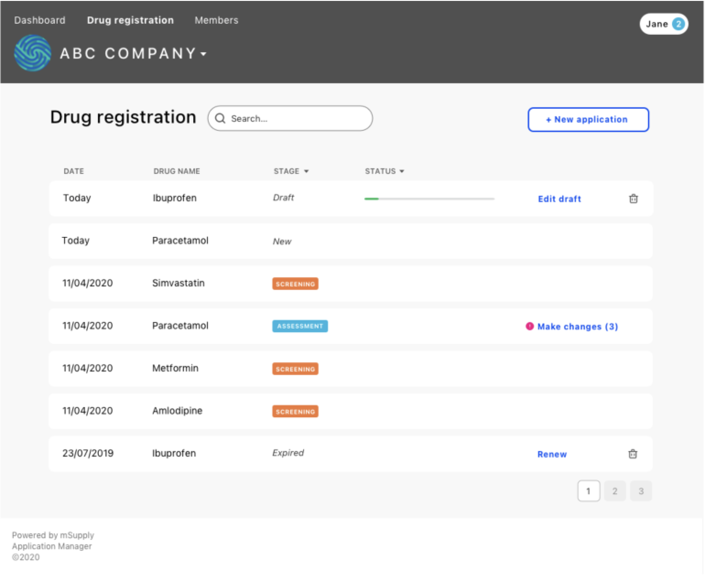

## Overview

---

The list of applications to display for the current user is based on:

- its permissions to view a certain group of applications
- the application type (aka template code)
- other optional filters selected

The user has access to links to see each type of application list from the top menu or in their dashboard - the link will set basic filters in the main URL route of the list: `/applications`. For example the list to see the Application of type "Drug Registration" would take the user to `/applications?type=user-registration&user-role=applicant`.

The `type` is the template code for the applications type, also displayed in the header of the Applications list.
The `user-role` is used to determine how the columns and rows should be displayed. The user-role is deduced from the permissions that the current user has to view this application type. In this example the user has **applicant** role by what was set in their permissions.

## Table of contents

### Filters

- [type](#type)
- [category](#category)
- [stage](#stage)
- [sort-by](#sort-by)
- [user-role](#user-role)
- [outcome](#outcome)
- [action](#action)
- [assigned](#assigned)
- [consolidator](#consolidator)
- [applicant](#applicant)
- [org](#org)
- [search](#search)
- [last-active-date](#last-active-date)
- [deadline-date](#deadline-date)
- [page](#page)
- [per-page](#per-page)

### More

- [Format & Rules](#format-and-rules)
- [Columns per role](#columns)

## Example: [UI Design] Applicant - applications list

---

## Filters

---

### Label filters:

#### type

**This is a compulsory filter**
In case none is included in URL will be deduced from 1st user's persmissions

Example: `type=user-registration`  
Considered in implementation: **Yes** [#131 - Headers]  
Can have combined values: **No**

Options:

- `template-code` - Of application type in list (and header)

#### category

Example: `category=company`  
Considered in implementation: **Yes** **[New issue?]**  
Can have combined values: **No**  
Options:

- `category-code` - Group of templates (application types)

#### stage

Example: `stage=screening`  
Considered in implementation: **Yes** [#251 - Filters]  
Can have combined values: **Yes** e.g: `stage=screening,assessment,final-decision`  
Options:

- Set of `stage-name` which is deduced per template (application type)

#### sort-by

Example: `sort-by=stage:asc`  
Considered in implementation: **Yes** [#131 - Headers]  
Can have combined values: **Yes** `sort-by=stage:asc,application-name:desc`  
Options:

- `column-name:direction`
- direction [Optional] `asc`/`desc`
- if no direction is included use default: `desc`

#### user-role

**This is a **compulsory** filter.**
In case none is included in URL will be deduced from permission of type in user's persmissions.

Example: `user-role=applicant`  
Considered in implementation: **Yes** [#131 - Headers]  
Can have combined values: **No**  
Options:

- Deduced by user's permissions (**TODO: More detailed explanation of user-role per permissions**)

#### outcome

Example: `outcome=pending`  
Considered in implementation: **Yes** [#251 - Filters]  
Can have combined values: **Yes** e.g: `outcome=pending,approved`  
Options:

- Set of `outcome` common for all templates (application types)

#### action

Example: `action=edit-draft`  
Considered in implementation: **Yes** [#251 - Filters]  
Can have combined values: **Yes** e.g: `action=edit-draft,make-updates`  
Options:

- Applicant:
  `edit-draft`
  `make-updates`
  `renew`
  `view` (Submitted)
- Reviewer
  `start-review`
  `continue-review`
  `review-updates`
  `view` (Submitted)
- Consolidator
  `assign`
  `consolidate`
  `review-updates`
  `view` (Submitted)

---

### String filters:

#### assigned

Example: `assigned=none`  
Considered in implementation: **Yes** [#251 - Filters]  
Can have combined values: **Yes** e.g: `assigned=none,"Carl"`  
Options:

- `none` - Applications with sections not-assigned
- `"username"` - Reviewer username

#### consolidator

Example: `consolidator="Tony"`  
Considered in implementation: **Yes** [#251 - Filters]  
Can have combined values: **Yes** e.g: `consolidator="Tony","Andrei"`  
Options:

- `"username"` - Consolidator username

#### applicant

Example: `applicant="John"`  
Considered in implementation: **No**  
Can have combined values: **Yes** e.g: `applicant="John","Nicole"`  
Options:

- `"username"` - Applicant username

#### org

Example: `org="Company A"`  
Considered in implementation: **Yes** [#251 - Filters]  
Can have combined values: **Yes** e.g: `org="Company A","Company B"`  
Options:

- `"organisation name"`

#### search

Example: `search="abc 123"`  
Considered in implementation: **Yes** [#251 - Filters]  
Can have combined values: **No**  
Options:

- String containing [A-Z], [a-z], [0-9], _space_
- Uses _starts with_ on search including following columns: "Application name", "Stage", ... (**TODO: continue listing columns**)
- (See more rules on Formats & Rules)

---

### Date filters:

#### last-active-date

Example: `last-active-date=2021-01-01`  
Considered in implementation: **Yes** [#228 - Dates in columns]  
Can have combined values: **Yes** e.g: `last-active-date=today,last-week`  
Options:

- Pre-defined string: `today` (See more formats on Formats & Rules)
- Single date: `YYYY-MM-DD`
- Period (start:end): `YYYY-MM-DD:YYYY-MM-DD`
- Period (start:) or (:end): `YYYY-MM-DD:` (end at last date) or `:YYYY-MM-DD` (start at first date)

#### deadline-date

Example: `deadline-date=2021-01-31`  
Considered in implementation: **Yes** [#228 - Dates in columns]  
Can have combined values: **Yes** e.g: `deadline-date=today,2021-01-02`  
Options:

- Pre-defined string: `today` (See more formats on Formats & Rules)
- Single date: `YYYY-MM-DD`
- Period (start:end): `YYYY-MM-DD:YYYY-MM-DD`
- Period (start:) or (:end): `YYYY-MM-DD:` (end at last date) or `:YYYY-MM-DD` (start at first date)

---

### Integer filters:

#### page

Example: `page=1`  
Considered in implementation: **Yes** [#210 - Pagination]  
Can have combined values: **No**  
Options:

- Positive number (When page number doesn't existing no results are displayed)

#### per-page

Example: `per-page=20`  
Considered in implementation: **Yes** [#210 - Pagination]  
Can have combined values: **No**  
Options:

- Number between 10 - 100

---

## Formats & Rules

---

### Pre-defined dates

`today`, `yesterday`, `this-week`, `last-week`, `this-month`, `last-month`, `this-quarter`, `last-quarter`,`this-year`, `last-year`, ...

(Add other pre-defined date here)

### Strings

Can't have special caracters.
Are case insensitive. So `thisTHAT` = `THISthat` = `thisthat`.

### Labels

When combined labels are used (with separator `,`) the query will be using the OR connector.

### General

When combined filters are used (with separator `&`) the query will be using the AND connector.  
Filters that aren't provided would be considered as fetch ALL.  
A few filters should automatically used (example page number) and would be in the query filters mirroring the current displayed query.

---

## Columns per user-role

---

### Common columns (For all user-roles)

- Serial number
- Last active date
- Application name
- Stage
- Status / Actionable

### Applicant

- Deadline date
- Progress

### Reviewer

- Applicant
- Organisation
- Consolidator
- Sections columns:
  - Section title
  - _Assigned to you_ / _Assigned to another_
  - Progress

### Consolidator

- Applicant
- Organisation
- Sections columns:
  - Section title
  - Reviewer
  - Progress
