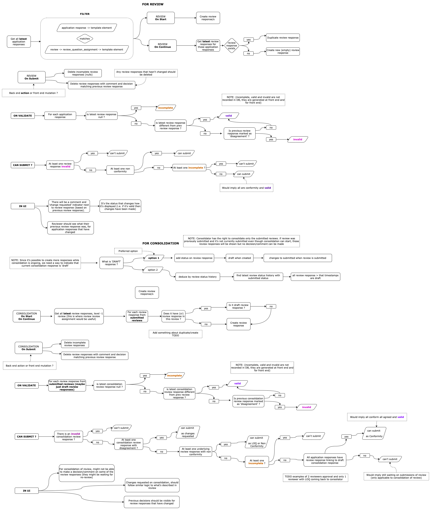

# Level 1+ Reviews and Changes Requested

The [Level 1 Reviews](Level-1-Review-And-LOQ.md) explains how reviews with only 1 level works. Which is a subset of how a review with more levels (per stage) should work. The aim of this page is to outline the structure and flow of:

- Reviewer (Level 1) - reviewing an application
- Reviewer (Level 1) - submitting `LOQ (List of Questions)`, `Conform` or `Non Conform` advise to upper level reviewer
- Reviewer (Level 2) - reviewing the lower level review and `disagree` with some advised decisions
- Reviewer (Level 2) - submitting `Changes Requested` back to reviewer
- Reviewer (Level 1) - making changes in response to `Changes Requested` and re-submitting to upper level reviewer
- Reviewer (Level 2) - reviewing the lower level review and `agree` with all advised decisions
- Reviewer (Level 2) - submitting `LOQ (List of Questions)`, `Conform` or `Non Conform` to Applicant - if `is_last_level` or upper level reviewer. In case there is a Level 3, the same process will happen again between Level 2 and Level 3 reveiwers.

### Back End

- On review level 1 **start**:
  - creates new `review` with status `DRAFT` to inform front end of action `CONTINUE_REVIEW` for this user
  - create `review_response` with status `DRAFT` for each `review_question_assignment` associated to `application_response`
- On review level 1 **submission**:
  - trim `review_responses` that have been created but not reviewed by user
  - update other `review_response` status to `SUBMITTED`
  - update `review` status to `SUBMITTED` to inform front end of action `VIEW_REVIEW` is available so this review is not editable
  - create new `review_assignment` for each user that can do reviewer level 2
- On review level 2 **self-assign**:
  - update `review_assignment` status `ASSIGNED` associated with this review to inform front end of action `START_REVIEW` for this user
  - update other `review_assignment` status to `SELF_ASSIGNED_BY_ANOTHER` to inform front end that other reviews cannot be assigned
  - create `review_question_assignment` to each `review_response` with status `SUBMITTED` from previous review
- On review level 2 **start**:
  - creates new `review` with status as `DRAFT` to inform front end of action `CONTINUE_REVIEW` for this user
  - create `review_response` with status `DRAFT` for each `review_question_assignment` associated to `review_response`
- On review level 2 **submission**:
  - trim `review_response` that have been created but not reviewed by user
  - update other `review_response` status to `SUBMITTED`
  - update `review` status to `SUBMITTED` to inform front end of action `VIEW_REVIEW` is available so this review is not editable.
  - update reviews with associated `review_response` (by `review_response_link_id`) with decision of `disagree` by level 2 status to `CHANGES_REQUESTED` to inform front end of action `UPDATE_REVIEW` for user owner of the Review level 1
- On review level 1 **update**:
  - creates new `review` with status as `DRAFT` to inform front end of action `CONTINUE_REVIEW` for this user
  - create `review_response` with status `DRAFT` duplicating lastest `review_response` with status `SUBMITTED` from this user
- On review level 1 **submission**:
  - trim `review_responses` that are duplicated and not changed
  - update `review` status to `SUBMITTED` to inform front end of action `VIEW_REVIEW` is available so this review is not editable
  - update other `review` of level 2 with `review_question_assignment` associated to `review_response` status to `PENDIND` to inform front end of action `RESTART_REVIEW` for this user

### Front End

- Fetches actions and calculates progress of review (from application) or review with changes requested
- GraphQL mutation to create review responses - linked to another review or to application response
- GraphQL mutation to update `review_response` and `review_decison`
- Validates submission of review and give options to submmit based on `is_last_level` and if review is level 1+
- GraphQL mutation to request submission of review

Similart to what was in previous [Level 1 Reviews](Level-1-Review-And-LOQ.md), but considering review of review.

## Validation of Submission

When **review** is updated as a result of `Changes Requested` by a Level 1+ reviewer, it can only be submitted if general validation passes AND all questions with change requests have been changed. Logic for this is:

`thisReviewLastestResponse` is different to `thisReviewPreviousResponse` that has some associated `reviewResponse.reviewResponseLinkId` with decision of `disagree`. This is more easily validated with fields `isChangeRequest` and `isChanged` in the 'state' of each element.

### Review validity

